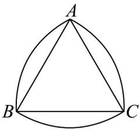

<!-- question-source:start -->
【典例1】莱洛三角形是以机械学家莱洛的名字命名，在建筑、商品的外包装设计、工业生产中有广泛的应

用，它是分别以等边三角形的每个顶点为圆心，以边长为半径，在另两个顶点之间画一段圆弧，由这三段圆

弧围成的曲边三角形·如图，若莱洛三角形的 $\frac{2\pi}{3} C$ 长为 $\frac{2\pi}{3}$ ，则该莱洛三角形的面积为（）

A. $2\pi - 3\sqrt{3}$ B. $2(\pi - \sqrt{3})$ C. $2\pi - \sqrt{3}$ D. $\pi - \sqrt{3}$
<!-- question-source:end -->

![[高中/课堂同步/题库/人教A版高中数学同步讲义(2026)/01_必修第一册/第五章 三角函数/专题5.1 任意角和弧度制（高效培优讲义）数学人教A版2019高一必修第一册/题型06_扇形的弧长及面积公式的应用/questions/answers/Q00076633A1.md]]
