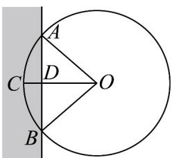

<!-- question-source:start -->
【变式3】我国古代数学经典著作《九章算术》中记载了一个“圆材埋壁”的问题：“今有圆材埋壁中，不知大

小，以锯锯之，深一寸，锯道长一尺，问径几何？”现有一类似问题：不确定大小的圆柱形木材，部分埋在墙

壁中，其截面如图所示．用锯去锯这木材，若锯口深 $CD = 2 - \sqrt{2}$ ，锯道 $AB = 2\sqrt{2}$ ，则图中弧 $ACB$ 与弦 $AB$

围成的弓形面积为（）

A. $\pi$ B. $\pi -2$ C. 4 D. $2\pi -2$
<!-- question-source:end -->

![[高中/课堂同步/题库/人教A版高中数学同步讲义(2026)/01_必修第一册/第五章 三角函数/专题5.1 任意角和弧度制（高效培优讲义）数学人教A版2019高一必修第一册/题型06_扇形的弧长及面积公式的应用/questions/answers/Q00076636A1.md]]
