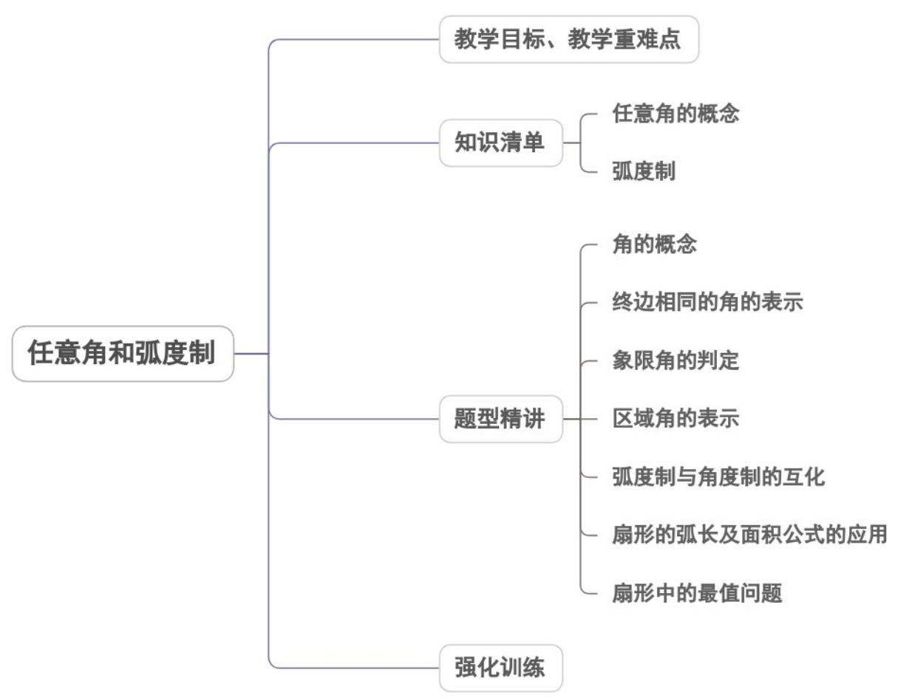
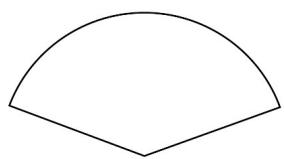
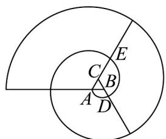

<!-- source-part:1 pages:1-43 -->

## 专题5.1 任意角和弧度制

## 内容概览

## 教学目标、教学重难点

<table><tr><td>教学目标</td><td>1.理解并掌握正角、负角、零角的概念。2.掌握象限角的范围,掌握终边相同的角的表示方法及判定方法。3.了解弧度制,能进行弧度与角度的互化。4.由圆周角找出弧度制与角度制的联系,记住常见特殊角对应的弧度数。5.掌握弧度制中扇形的弧长公式和面积公式,能用公式进行简单的弧长及面积运算。</td></tr><tr><td>教学重难点</td><td>1.重点:掌握弧度制与角度制的互化。</td></tr></table>

## 知识清单

## 知识点 01 任意角的概念

1、角可以看成平面内一条射线绕着端点从一个位置旋转到另一个位置所成的图形.

正角：按逆时针方向旋转所形成的角。

负角：按顺时针方向旋转所形成的角．

零角：如果一条射线没有做任何旋转，我们称它形成了一个零角。

## 2、终边相同的角、象限角

终边相同的角为 $\beta \in \{\beta \mid \beta = 2k\pi + \alpha, k \in Z\}$

角的顶点与原点重合，角的始边与 $x$ 轴的非负半轴重合．那么，角的终边（除端点外）在第几象限，我们就

说这个角是第几象限角．

## 3、常用的象限角

<table><tr><td>角的终边所在位置</td><td>角的集合</td></tr><tr><td>x轴正半轴</td><td>{α|α=k×360°, k∈Z}</td></tr><tr><td>y轴正半轴</td><td>{α|α=k×360°+90°, k∈Z}</td></tr><tr><td>x轴负半轴</td><td>{α|α=k×360°+180°, k∈Z}</td></tr><tr><td>y轴负半轴</td><td>{α|α=k×360°+270°, k∈Z}</td></tr><tr><td>x轴</td><td>{α|α=k×180°, k∈Z}</td></tr><tr><td>y轴</td><td>{α|α=k×180°+90°, k∈Z}</td></tr><tr><td>坐标轴</td><td>{α|α=k×90°, k∈Z}</td></tr></table>

$\alpha$ 是第一象限角，所以 $\left\{\alpha \mid 2k\pi < \alpha < 2k\pi + \frac{1}{2}\pi (k \in Z)\right\}$ $\alpha$ 是第二象限角，所以 $\left\{\alpha \mid 2k\pi + \frac{\pi}{2} < \alpha < 2k\pi + \pi (k \in Z)\right\}$ $\alpha$ 是第三象限角，所以 $\left\{\alpha \mid 2k\pi + \pi < \alpha < 2k\pi + \frac{3}{2}\pi (k \in Z)\right\}$ $\alpha$ 是第四象限角，所以 $\left\{\alpha \mid 2k\pi + \frac{3}{2}\pi < \alpha < 2k\pi + 2\pi (k \in Z)\right\}$

## 【即学即练】

1. 下列说法正确的是（ ）

【答案】
A. 角 $60^{\circ}$ 和角 $600^{\circ}$ 是终边相同的角
B. 第三象限角的集合为 $\left\{\alpha \mid \pi + 2k\pi \leq \alpha \leq \frac{3\pi}{2} + 2k\pi, k \in \mathbb{Z}\right\}$ C. 终边在 $y$ 轴上角的集合为 $\left\{\alpha \mid \alpha = k\pi + \frac{\pi}{2}, k \in \mathbb{Z}\right\}$ D. 第二象限角大于第一象限角

【答案】C

【详解】 $600^{\circ}=360^{\circ}+240^{\circ}$ ，因此 $600^{\circ}$ 的解与 $240^{\circ}$ 角的终边相同，A错；

第三象限角的集合为 $\left\{\alpha\mid\pi+2k\pi<\alpha<\frac{3\pi}{2}+2k\pi,k\in\mathbb{Z}\right\}$ ，B 错；

终边在 y 轴上角，终边可能在 y 轴正半轴， $\alpha = 2k\pi + \frac{\pi}{2}$ ，

终边在 $y$ 轴负半轴， $\alpha = 2k\pi +\frac{3\pi}{2}$ ，其中 $k\in \mathbb{Z}$ ，终合为 $\alpha = k\pi +\frac{\pi}{2},k\in \mathbb{Z}$ ，C正确；

$\frac{2\pi}{3}$ 是第二象限角， $\frac{7\pi}{3}$ 是第一象限角，但 $\frac{2\pi}{3}<\frac{7\pi}{3}$ ，D 错。

故选：C.

2. 下列命题正确的是（）.

【答案】
A．小于 $90^{\circ}$ 的角是锐角
B．第二象限的角一定大于第一象限的角
C．与 $-2024^{\circ}$ 终边相同的最小正角是 $136^{\circ}D$ ．若 $\alpha=-2$ ，则 $\alpha$ 是第四象限角

【答案】C

【详解】 $-10^{\circ}<90^{\circ}$ ，但是由锐角的定义知 $-10^{\circ}$ 不是锐角，故 $^{A}$ 错误；

$100^{\circ}$ 是第二象限的角， $400^{\circ}$ 是第一象限的角，但 $100^{\circ} < 400^{\circ}$ ，故 ${}^{\mathrm{B}}$ 错误；

因为 $-2024^{\circ} = -6 \times 360^{\circ} + 136^{\circ}$ ，所以与 $-2024^{\circ}$ 终边相同的最小正角是 $136^{\circ}$ ，故 $C$ 正确；

$\alpha = -2 < -\frac{\pi}{2}$ 且 $\alpha = -2 > -\pi$ ，所以 $\alpha$ 是第三象限角，故D错误

故选：C

知识点 02 弧度制

## 1、弧度制的定义

长度等于半径长的圆弧所对的圆心角叫做1弧度角，记作 $1^{rad}$ ，或1弧度，或1（单位可以省略不写）.

## 2、角度与弧度的换算

弧度与角度互换公式： $180^{\circ} = \pi rad$

$$
1 r a d = \left(\frac {1 8 0}{\pi}\right) ^ {0} \approx 5 7. 3 0 ^ {\circ} = 5 7 ^ {\circ} 1 8 ^ {\prime}, 1 ^ {\circ} = \frac {\pi}{1 8 0} \approx 0. 0 1 7 4 5 (r a d)
$$

3、弧长公式： $l = |\alpha |r$ （ $\alpha$ 是圆心角的弧度数），

扇形面积公式： $S=\frac{1}{2}lr=\frac{1}{2}\left|\alpha\right|r^{2}$

## 【即学即练】

1. 折扇在中国已有三千多年的历史，“扇”与“善”谐音，折扇也寓意“善良”“善行”它常以字画的形式体现我国的

传统文化(如图 1)，也是“运筹帷幄”“决胜千里”“大智大勇”的象征，图 2 为其结构简化图·若在圆形纸张上剪下一

把扇形的扇子(扇形的半径和圆形纸张的半径相同)，记该扇形的面积为 $S_{1}$ ，剩下的图形面积为 $S_{2}$ ，若 $S_{1}$ 与 $S_{2}$

$$
\frac {\sqrt {5} - 1}{2}
$$

的比值满足黄金分割值 2，则扇子的圆心角大约为（）（参考数据： $\sqrt{5}\approx2.236$ ）

图1

图2

A. $222^{\circ}$ B. $146^{\circ}$ C. $138^{\circ}$ D. $111^{\circ}$

【答案】C

【详解】设扇形的圆心角为 $\alpha$ ，半径为 $r$ ，则 $S_{1} = \frac{1}{2}\alpha r^{2}$ ， $S_{2} = \pi r^{2} - \frac{1}{2}\alpha r^{2}$

所以 $\frac{S_1}{S_2} = \frac{\frac{1}{2}\alpha r^2}{\pi r^2 - \frac{1}{2}\alpha r^2} = \frac{\sqrt{5} - 1}{2}$ ，解得 $\alpha = \frac{2(\sqrt{5} - 1)}{\sqrt{5} + 1}\pi = (3 - \sqrt{5})\pi \approx 138^\circ$

故选：C

2．如图所示，省锡中数学社团用数学软件制作的“蚊香”图·画法如下：作一个边长为 $^{1}$ 的等边VABC，然后以B为圆心，AB为半径逆时针画圆弧交线段CB的延长线于点D（第一段圆弧，再以点C为圆心，CD为半径逆时针画圆弧交线段AC的延长线于点E，再以点A为圆心，AE为半径逆时针画圆弧……，以此类推，当得到的“蚊香”恰好有 $^{5}$ 段圆弧时，“蚊香”的长度为（）

【答案】

A $8\pi$ B $10\pi$ C $18\pi$ D $20\pi$

【答案】B

【详解】由题意知，每段圆弧的圆心角均为 $\frac{2\pi}{3}$ ，第一段圆弧长度为 $\frac{2\pi}{3} \times 1 = \frac{2\pi}{3}$ ，第二段圆弧长度为 $\frac{2\pi}{3} \times 2 = \frac{4\pi}{3}$ ，第三段圆弧长度为 $\frac{2\pi}{3} \times 3 = 2\pi$ ，第四段圆弧长度为 $\frac{2\pi}{3} \times 4 = \frac{8\pi}{3}$ ，第五段圆弧长度为 $\frac{2\pi}{3} \times 5 = \frac{10\pi}{3}$ ，

所以“蚊香”的长度为 $\frac{2\pi}{3}+\frac{4\pi}{3}+2\pi+\frac{8\pi}{3}+\frac{10\pi}{3}=10\pi$

故选：B.

## 题型精讲

![[高中/课堂同步/题库/人教A版高中数学同步讲义(2026)/01_必修第一册/第五章 三角函数/专题5.1 任意角和弧度制（高效培优讲义）数学人教A版2019高一必修第一册（解析版）/题型01_角的概念/题型01_角的概念.md]]
![[高中/课堂同步/题库/人教A版高中数学同步讲义(2026)/01_必修第一册/第五章 三角函数/专题5.1 任意角和弧度制（高效培优讲义）数学人教A版2019高一必修第一册（解析版）/题型02_终边相同的角的表示/题型02_终边相同的角的表示.md]]
![[高中/课堂同步/题库/人教A版高中数学同步讲义(2026)/01_必修第一册/第五章 三角函数/专题5.1 任意角和弧度制（高效培优讲义）数学人教A版2019高一必修第一册（解析版）/题型03_象限角的判定/题型03_象限角的判定.md]]
![[高中/课堂同步/题库/人教A版高中数学同步讲义(2026)/01_必修第一册/第五章 三角函数/专题5.1 任意角和弧度制（高效培优讲义）数学人教A版2019高一必修第一册（解析版）/题型04_区域角的表示/题型04_区域角的表示.md]]
![[高中/课堂同步/题库/人教A版高中数学同步讲义(2026)/01_必修第一册/第五章 三角函数/专题5.1 任意角和弧度制（高效培优讲义）数学人教A版2019高一必修第一册（解析版）/题型05_弧度制与角度制的互化/题型05_弧度制与角度制的互化.md]]
![[高中/课堂同步/题库/人教A版高中数学同步讲义(2026)/01_必修第一册/第五章 三角函数/专题5.1 任意角和弧度制（高效培优讲义）数学人教A版2019高一必修第一册（解析版）/题型06_扇形的弧长及面积公式的应用/题型06_扇形的弧长及面积公式的应用.md]]
![[高中/课堂同步/题库/人教A版高中数学同步讲义(2026)/01_必修第一册/第五章 三角函数/专题5.1 任意角和弧度制（高效培优讲义）数学人教A版2019高一必修第一册（解析版）/题型07_扇形中的最值问题/题型07_扇形中的最值问题.md]]
![[高中/课堂同步/题库/人教A版高中数学同步讲义(2026)/01_必修第一册/第五章 三角函数/专题5.1 任意角和弧度制（高效培优讲义）数学人教A版2019高一必修第一册（解析版）/强化训练/强化训练.md]]
