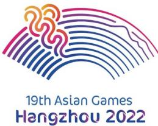
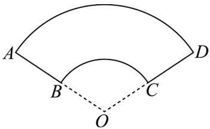

<!-- question-source:start -->
18．如图 1，这是杭州第 19 届亚运会会徽，名为“潮涌”。如图 2，这是“潮涌”的平面图，若 OA = 2OB，则图

形ABCD的面积与扇形AOD的面积的比值是\_\_\_\_.

图1

图2
<!-- question-source:end -->

![[高中/课堂同步/题库/人教A版高中数学同步讲义(2026)/01_必修第一册/第五章 三角函数/专题5.1 任意角和弧度制（高效培优讲义）数学人教A版2019高一必修第一册（解析版）/强化训练/questions/answers/Q00076015A1.md]]
