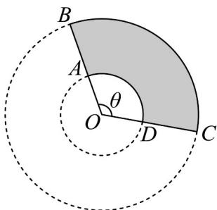

<!-- question-source:start -->
19. 如图所示，君洪楼门前广场上有一块扇形环面区域（由扇形 $OBC$ 去掉扇形 $OAD$ 构成）种植绿植和花卉，需要用栅栏围起来进行绿化养护。知 $OB = 20$ 米， $OA = x$ 米，扇形环面区域面积为100平方米，圆心角为 $\theta$ 弧度 $(0 < \theta < \pi)$ 。

(1)求 $\theta$ 关于 $x$ 的函数解析式；

(2)记花卉周围栅栏（由弧 $AD$ 、 $BC$ ，弧线段 $DC$ 、 $BA$ 组成）的长度为 $y$ 米，试问 $x$ 取何值时， $y$ 的值最小？

并求出最小值．
<!-- question-source:end -->

![[高中/课堂同步/题库/人教A版高中数学同步讲义(2026)/01_必修第一册/第五章 三角函数/专题5.1 任意角和弧度制（高效培优讲义）数学人教A版2019高一必修第一册（解析版）/强化训练/questions/answers/Q00076016A1.md]]
