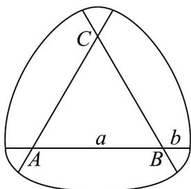

> [!faq]- 《专题5.1 任意角和弧度制（高效培优讲义）数学人教A版2019高一必修第一册（解析版）》官方解析
>
> > [!success]- **【答案】** A. $-30^{\circ}$ B. $-45^{\circ}$ C. $-225^{\circ}$ D. $-405^{\circ}$
>
> > [!note]- **【解析】**
> > 由 $k\cdot180^{\circ}-2025^{\circ}<0$ ，得k<11.25.
> >
> > 又 $k \in \mathbf{Z}$ ，所以角 $\alpha$ 符合条件的最大负角为 $\alpha = 11 \times 180^{\circ} - 2025^{\circ} = -45^{\circ}$ 。
> >
> > 故选：B.
> >
> > 5. 受鲁洛克斯三角形的启发，我们可以得到没有尖点的圆弧图形·如图，已知 $VABC$ 的所有边长均为 $a$ ，把 $VABC$ 的各边分别向两个方向延伸长度为 $b$ 的一段，然后以三个顶点为圆心分别画圆弧，使得三个内角所对的圆弧的半径均为 $a + b$ ，内角的对顶角所对的圆弧的半径均为 $b$ ，由这样的六条圆弧组成圆弧六边形·已知该圆弧六边形的面积为 $13\pi - 8\sqrt{3}$ ，周长为 $6\pi$ ，则 $a - b = (\quad)$
> >
> > 
> >
> > A.2 B. $\frac{5}{2}$ C. $\frac{8}{3}$ D.3
> >
> > 【答案】D
> >
> > 【详解】由题意可得圆弧六边形的面积为：
> >
> > $$
> > S = 3 \times \frac {1}{2} \times \frac {\pi}{3} \times (a + b) ^ {2} + 3 \times \frac {1}{2} \times \frac {\pi}{3} \times b ^ {2} - 2 \times \frac {\sqrt {3}}{4} a ^ {2}
> > $$
> >
> > $$
> > = \frac {\pi}{2} \left(a ^ {2} + 2 a b + 2 b ^ {2}\right) - \frac {\sqrt {3}}{2} a ^ {2} = 1 3 \pi - 8 \sqrt {3}
> > $$
> >
> > 圆弧六边形的周长为：
> >
> > $l=3\times\frac{\pi}{3}\times(a+b)+3\times\frac{\pi}{3}\times b=\pi(a+2b)=6\pi$ ，即 $a+2b=6$ ②
> >
> > 联立①②，解得 a = 4 ， b = 1 ，所以 a - b = 3 .
> >
> > 故选 **D**
