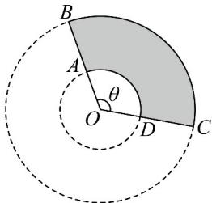

> [!faq]- 《专题5.1 任意角和弧度制（高效培优讲义）数学人教A版2019高一必修第一册（解析版）》官方解析
>
> > [!success]- **【答案】**  A. $y$ 最小值为 $20$ 厘米 B. $y$ 最小值为 $40$ 厘米 C. $y$ 最小值为 $60$ 厘米 D. $y$ 最小值为 $80$ 厘米
>
> > [!note]- **【解析】**
> > 依题意可得弧长 $AD = x\theta$ ，弧长 $BC = 20\theta$
> >
> > 所以扇环 $ABCD$ 的周长的长度 $y = x\theta + 20\theta + 2 \times (20 - x)$
> >
> > 因为扇形的面积公式可得 $\frac{1}{2}\theta \times 20^2 -\frac{1}{2}\theta \times x^2 = 100$ ，所以 $\theta = \frac{200}{400 - x^2}\big(0 <   x <   20\big)$
> >
> > 所以 $y=2\times(20-x)+(x+20)\times\frac{200}{400-x^{2}}=2\times(20-x)+\frac{200}{20-x}\quad2\sqrt{2\times(20-x)\times\frac{200}{20-x}}=40$
> >
> > 当且仅当 $2 \times (20 - x) = \frac{200}{20 - x}$ ，即 $x = 10$ 时取等号，
> >
> > 所以扇环 ABCD 的周长的最小值为 $^{40}$ 米.
> >
> > 故选 **B**.
