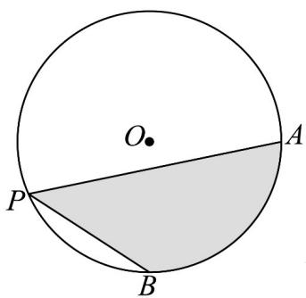
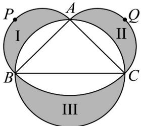

> [!faq]- 《专题5.1 任意角和弧度制（高效培优讲义）数学人教A版2019高一必修第一册（解析版）》官方解析
>
> > [!success]- **【答案】** $\pi + 2\sqrt{2}$
>
> > [!note]- **【解析】**
> > 
> >
> > $$
> > \because \angle A P B = \frac {\pi}{4}, \therefore \angle A O B = \frac {\pi}{2} \quad \therefore S _ {\text {扇} A O B} = \frac {1}{2} \times \frac {\pi}{2} \times 2 ^ {2} = \pi , S _ {\triangle A O B} = 2
> > $$
> >
> > 所以在扇形 AOB 中，弓形面积为 $\pi - 2$ ，
> >
> > 在等腰直角 $\triangle AOB$ 中， $AB = 2\sqrt{2}$ ， $P$ 到 $AB$ 最大距离为半径加上等腰直角 $\triangle AOB$ 底边 $AB$ 上的高，即为
> >
> > $$
> > 2 + \sqrt {2}
> > $$
> >
> > 所以 $\left(S_{\triangle APB}\right)_{\max} = \frac{1}{2}\times 2\sqrt{2}\times \left(2 + \sqrt{2}\right) = 2 + 2\sqrt{2}$
> >
> > 所以阴影面积 $=\pi-2+\left(2+2\sqrt{2}\right)=\pi+2\sqrt{2}$
> >
> > 故答案为： $\pi+2\sqrt{2}$
> >
> > 17. 月牙定理指以直角三角形两条直角边为直径向外作两个半圆，以斜边为直径向内作半圆，则三个半圆所
> >
> > 围成的两个月牙形面积之和等于该直角三角形的面积·该定理“化圆为方”解决了曲、直两个图形可以等面积的
> >
> > 问题·如图所示，△ABC为大圆的内接等腰直角三角形，大圆的半径为 $^{1}$ 米，分别以AB，AC为直径作半圆
> >
> > $APB$ ， $AQC$ ，与大圆分别围成了区域I、II，大圆圆内的弧线是以 $A$ 为圆心， $AC$ 为半径的圆的一部分，与大圆
> >
> > 围成了区域III，则图中区域III的月牙形的周长为\_\_\_\_米；三个区域的总面积为\_\_\_\_。
> >
> > 平方米·
> >
> > 
> >
> > 【答案】
> >
> > $$
> > \frac {\sqrt {2} + 2}{2} \pi
> > $$
> >
> > 【详解】∵ $\triangle ABC$ 为大圆的内接等腰直角三角形，∴ BC 为大圆的直径，
> >
> > ∵ 大圆的半径为 $^{1}$ 米，∴ BC = 2 米，
> >
> > $\therefore AB = AC = \sqrt{2}, \angle BAC = \frac{\pi}{2},$
> >
> > ∴ 区域Ⅲ的周长为 $\frac{1}{2} \times 2\pi \times 1 + \frac{\pi}{2} \times \sqrt{2} = \frac{\sqrt{2} + 2}{2}\pi$ ;
> >
> > 根据月牙定理可知，区域I、II的面积之和为 $S_{\triangle ABC} = \frac{1}{2}\times \sqrt{2}\times \sqrt{2} = 1$
> >
> > 区域Ⅲ的面积为 $\frac{1}{2}\pi \times 1^2 -\left(\frac{1}{2}\times \frac{\pi}{2}\times \sqrt{2}^2 -\frac{1}{2}\times \sqrt{2}\times \sqrt{2}\right) = 1$
> >
> > $\therefore$ 三个区域的总面积为 $1+1=2$
> >
> > 故答案为： $\frac{\sqrt{2}+2}{2}\pi$ ；2·
