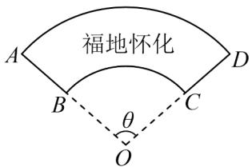

> [!faq]- 《专题5.1 任意角和弧度制（高效培优讲义）数学人教A版2019高一必修第一册（解析版）》官方解析
>
> > [!success]- **【答案】** (1) $\theta = \frac{200}{400 - x^2}$ $0 < x < 10\sqrt{4 - \frac{2}{\pi}}$ (2) 当 $x = 10$ 时，棚栏长度的最小值为 40 米
>
> > [!note]- **【解析】**
> > （1）利用扇形的面积公式可得 $\frac{1}{2}\theta \times 20^2 -\frac{1}{2}\theta \times x^2 = 100$ $\theta = \frac{200}{400 - x^2}$ 所以
> >
> > 由 $0 < \theta = \frac{200}{400 - x^{2}} < \pi$ 可得 $0 < x < 10\sqrt{4 - \frac{2}{\pi}}$
> >
> > 所以， $\theta=\frac{200}{400-x^{2}}\quad0<x<10\sqrt{4-\frac{2}{\pi}}$
> >
> > (2) 依题意可得弧长 $AD = x\theta$ ，弧长 $BC = 20\theta$ ，
> >
> > 所以栅栏的长度 $y = x\theta + 20\theta + 2 \times (20 - x)$ ，
> >
> > 将 $\theta = \frac{200}{400 - x^2}$ 代入上式，整理可得，
> >
> > $$
> > y = 2 (2 0 - x) + \frac {2 0 0}{2 0 - x} = 2 (2 0 - x + \frac {1 0 0}{2 0 - x}) \quad 4 \sqrt {(2 0 - x) \times \frac {1 0 0}{2 0 - x}} = 4 0
> > $$
> >
> > 当且仅当 x=10 时取等号，所以栅栏长度的最小值为 40 米。
> >
> > 20. 为了美化城市，某部门计划在一处绿化带做一个“福地怀化”字样的园圃，如图所示，该园圃的形状是扇
> >
> > 形 $OAD$ 挖去半径为其一半的扇形 $OBC$ 后得到的扇环 $ABCD$ ，园圃的外围周长为 $50\mathrm{m}$ ，其中圆心角 $\theta$ 小于 $\pi$
> >
> > $AB$ 的长不超过 $10\mathrm{m}$ .设 $AB = x$ （单位： $\mathfrak{m}$ ），园圃的面积为 $y$ （单位： $\mathrm{m}^2$ ）
> >
> > 
> >
> > (1)写出 $y$ 关于 $x$ 的函数表达式，并求出该函数的定义域；
> >
> > (2)当 $x$ 为多少时，园圃的面积 $y$ 最大，求出 $y$ 的最大值及此时 $\overline{AD}$ 与 $\overline{BC}$ 的长.
> >
> > 【答案】(1)答案见解析
> >
> > (2)答案见解析
> >
> > 【详解】（1）在扇形OAD中，由题意得AB=x，OA=2x
> >
> > 由扇形面积公式得扇形 $OAD$ 的面积为 $2x \times 2x \times \frac{1}{2} \times \theta = 2x^2\theta$
> >
> > 扇形 OBC 的面积为 $x \times x \times \frac{1}{2} \times \theta = \frac{1}{2} x^{2} \theta$
> >
> > 故 $y = 2x^{2}\theta - \frac{1}{2}x^{2}\theta = \frac{3}{2}x^{2}\theta$ ，由弧长公式得 $BC$ 的长度为 $x\theta$ ，
> >
> > $AD$ 的长度为 $2x\theta$ ，而园圃的外围周长为 $50m$ ，
> >
> > 故 $x\theta + 2x\theta + x + x = 50$ ，解得 $\theta = \frac{50 - 2x}{3x}$ ，
> >
> > 因为圆心角 $\theta$ 小于 $\pi$ ，所以 $0 < \frac{50 - 2x}{3x} < \pi$
> >
> > 解得 $\frac{50}{3\pi + 2} < x < 25$ ，而 $x \in (0,10]$ ，故 $x \in \left( \frac{50}{3\pi + 2}, 10 \right]$
> >
> > 故 $y=\frac{3}{2}x^{2}\times\frac{50-2x}{3x}=\frac{1}{2}x\times(50-2x)=25x-x^{2}$ ，该函数的定义域为 $x\in\left(\frac{50}{3\pi+2},10\right]$ (2) 由二次函数性质得 $y$ 在 $\left(\frac{50}{3\pi + 2}, 10\right]$ 内单调递增，当 $x = 10$ 时， $y$ 的最大值为 $y = 25 \times 10 - (10)^2 = 150$ ， $AD$ 的长度为 $2x \times \frac{50 - 2x}{3x} = \frac{2(50 - 2 \times 10)}{3} = 20$ ， $BC$ 的长度为 $x \times \frac{50 - 2x}{3x} = \frac{50 - 2 \times 10}{3} = 10$ .
