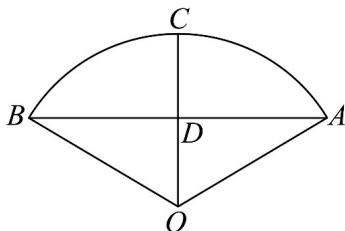

<!-- question-source:start -->
【变式1】如图，这是一块扇形菜地， $C$ 是弧 $AB$ 的中点， $O$ 是该扇形菜地的弧 $AB$ 所在圆的圆心， $D$ 为 $AB$

和 OC 的交点，若 $AB = 2\sqrt{3}CD = 6$ 米，则该扇形菜地的面积是（）

A. $4\pi$ 平方米 B. $4\sqrt{3}\pi$ 平方米 C. $6\sqrt{3}\pi$ 平方米 D. $3\pi$ 平方米
<!-- question-source:end -->

![[高中/课堂同步/题库/人教A版高中数学同步讲义(2026)/01_必修第一册/第五章 三角函数/专题5.1 任意角和弧度制（高效培优讲义）数学人教A版2019高一必修第一册（解析版）/题型06_扇形的弧长及面积公式的应用/questions/answers/Q00075996A1.md]]
