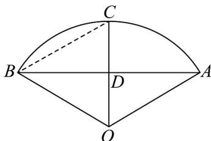

> [!faq]- 《专题5.1 任意角和弧度制（高效培优讲义）数学人教A版2019高一必修第一册（解析版）》官方解析
>
> > [!success]- **【答案】** A
>
> > [!note]- **【解析】**
> > 如图，连接 BC．因为 C 是弧 AB 的中点，所以 $AB \perp CD$ ， $BD = \frac{1}{2} AB = 3$ 米．
> >
> > 因为 $AB = 2\sqrt{3}CD$ ，所以 $\angle CBD = \frac{\pi}{6}$ ，所以 $\angle AOC = \angle BOC = \frac{\pi}{3}$ ，
> >
> > 所以 $\triangle OBC$ 是等边三角形，则 $\angle AOB = \frac{2\pi}{3}$ ．
> >
> > 因为 $AB = 2\sqrt{3}CD = 6$ 米，所以 $CD = \sqrt{3}$ 米， $OB = BC = \sqrt{BD^{2} + CD^{2}} = 2\sqrt{3}$ 米，
> >
> > 则该扇形菜地的面积是 $\frac{1}{2} \times \frac{2\pi}{3} \times (2\sqrt{3})^{2} = 4\pi$ 平方米．
> >
> > 
> >
> > 故选 **A**.
