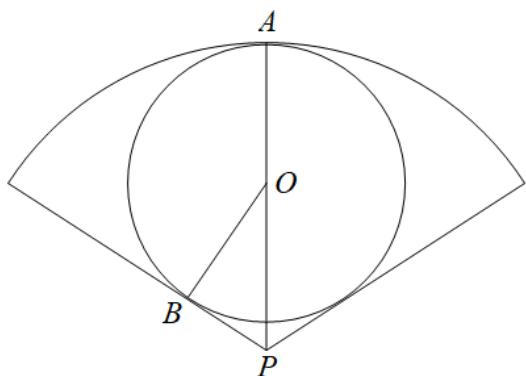

> [!faq]- 《专题5.1 任意角和弧度制（高效培优讲义）数学人教A版2019高一必修第一册（解析版）》官方解析
>
> > [!success]- **【答案】** A. $5-\frac{1}{\sin1}$ B. $\frac{1}{\sin1}+\frac{3}{2}$ C. $\frac{5\sin1}{1+\sin1}$ D. $5+\frac{5}{1+\sin1}$
>
> > [!note]- **【解析】**
> > 设扇形的半径为 $R$ ，圆心角为 $\alpha$ ，面积为S，因为 $2R + \alpha R = 20$
> >
> > 所以 $S = \frac{1}{2}\alpha R^2 = (10 - R)R\leq \left(\frac{10 - R + R}{2}\right)^2 = 25$ ，取等号时 $10 - R = R$ ，即 $R = 5$
> >
> > 所以面积取最大值时 $R = 5, \alpha = 2$
> >
> > 如下图所示：
> >
> > 
> >
> > 设内切圆圆心为 O，扇形过点 O 的半径为 AP，B 为圆与半径的切点，
> >
> > 因为 $AO + OP = R = 5$ ，所以 $r + \frac{r}{\sin\angle BPO} = 5$ ，所以 $r + \frac{r}{\sin 1} = 5$
> >
> > 所以 $r=\frac{5\sin1}{1+\sin1}$
> >
> > 故选 **C**.
