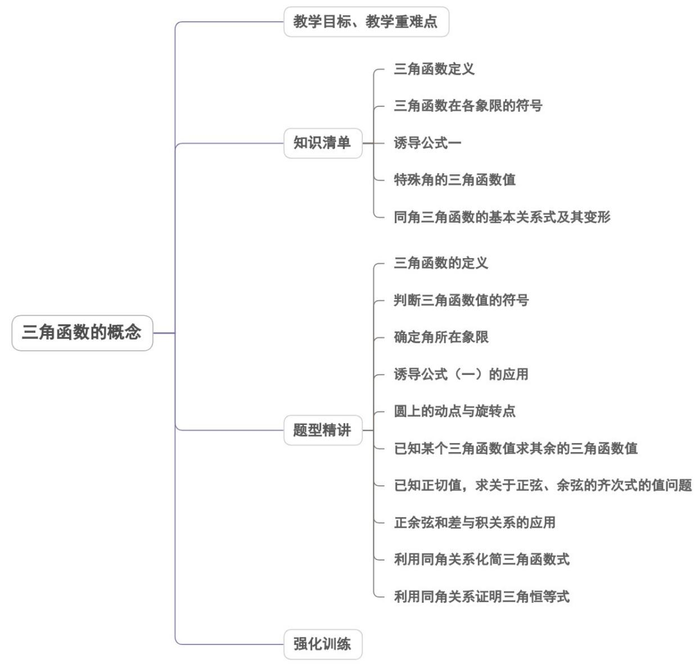
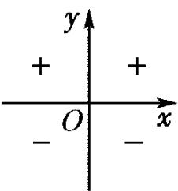
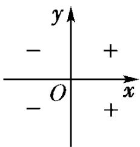
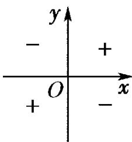

<!-- source-part:1 pages:1-50 -->

专题5.2 三角函数的概念

## 内容概览

## 教学目标、教学重难点

<table><tr><td>教学目标</td><td>1.理解结合单位圆定义三角函数的意义。2.结合任意角终边与单位圆的交点会求任意角的正弦、余弦、正切值。3.根据任意角终边所在象限的位置,会判断任意角三角函数值的符号。4.掌握同角三角函数的基本关系式。5.能正确运用同角三角函数的基本关系式进行求值、化简和证明。</td></tr><tr><td>教学重难点</td><td>1.重点:会求任意角的三个三角函数值并能准确判断任意角的三角函数值的符号。2.难点:会用同角三角函数的基本关系进行求值、化简、证明。</td></tr></table>

## 知识清单

## 知识点01 三角函数定义

设 $\alpha$ 是一个任意角，它的终边与半径是 $r$ 的圆交于点 $P(x,y)$ ，则 $r = \sqrt{x^2 + y^2}$ ，那么：

(1) $\frac{y}{r}$ 做 $\alpha$ 的正弦，记做 $\sin \alpha$ ，即 $\sin \alpha = \frac{y}{r}$

(2) $\frac{x}{r}$ 叫做 $\alpha$ 的余弦，记做 $\cos \alpha$ ，即 $\cos \alpha = \frac{x}{r}$

(3) $\frac{y}{x}$ 叫做 $\alpha$ 的正切，记做 $\tan \alpha$ ，即 $\tan \alpha = \frac{y}{x} (x \neq 0)$

## 【即学即练】

1. 在平面直角坐标系 $xOy$ 中，角 $\alpha$ 以 $Ox$ 为始边，终边经过点 $(t,2t)$ ， $t > 0$ ，则 $\cos \alpha = (\quad)$ A. $\frac{\sqrt{5}}{5}$ B. $-\frac{\sqrt{5}}{5}$ C. $\frac{2\sqrt{5}}{5}$ D. $-\frac{2\sqrt{5}}{5}$

【答案】A

【详解】由题意可得， $\cos \alpha = \frac{t}{\sqrt{t^2 + 4t^2}} = \frac{1}{\sqrt{5}} = \frac{\sqrt{5}}{5}$ 。

故选：A.

2. 已知角 $\alpha$ 的终边经过点 $P(4,3)$ ，则 $\cos \alpha = (\quad)$ A. $\frac{3}{5}$ B. $\frac{3}{4}$ C. $\frac{4}{5}$ D. $\frac{4}{3}$

【答案】C

【详解】因为角 $\alpha$ 的终边经过点 $P(4,3)$ ，则 $\cos \alpha = \frac{4}{\sqrt{4^2 + 3^2}} = \frac{4}{5}$

故选：C.

## 知识点 02 三角函数在各象限的符号

三角函数在各象限的符号：

sin $\alpha$

cos α

tan $\alpha$

在记忆上述三角函数值在各象限的符号时，有以下口诀：一全正，二正弦，三正切，四余弦.【即学即练】

1. 若 $\alpha$ 是第四象限角，则点 $P(\cos\frac{\alpha}{2},\tan\frac{\alpha}{2})$ 在第（）象限
A. 第四象限 B. 第三象限
C. 第三、四象限 D. 第一、二象限

【答案】C

【详解】因 $\alpha$ 是第四象限角，即 $2k\pi -\frac{\pi}{2} <  \alpha <  2k\pi ,k\in \mathbb{Z}$ ，则 $k\pi -\frac{\pi}{4} < \frac{\alpha}{2} < k\pi ,k\in \mathbb{Z}$ 当 $k$ 是奇数时， $\frac{\alpha}{2}$ 是第二象限角， $\cos \frac{\alpha}{2} <  0,\tan \frac{\alpha}{2} <  0$ ，点 $P$ 在第三象限，当 $k$ 是偶数时， $\frac{\alpha}{2}$ 是第四象限角， $\cos \frac{\alpha}{2} >0,\tan \frac{\alpha}{2} <  0$ ，点 $P$ 在第四象限，

所以点 $P$ 在第三、四象限·

故选：C

2. 已知 $\sin\alpha>0$ , $\cos\alpha<0$ , 则 $\frac{\alpha}{3}$ 的终边在 ( )

【答案】

A. 第一、二、三象限

B. 第二、三、四象限

C. 第一、三、四象限

D. 第一、二、四象限

【答案】D

【详解】因为 $\sin \alpha > 0$ ， $\cos \alpha < 0$

所以 $\alpha$ 为第二象限角，即 $\frac{\pi}{2} + 2k\pi < \alpha < \pi + 2k\pi, k \in \mathbb{Z}$ ，

所以 $\frac{\pi}{6} +\frac{2k\pi}{3} <  \frac{\alpha}{3} <  \frac{\pi}{3} +\frac{2k\pi}{3},k\in \mathbb{Z}$

则 $\frac{\alpha}{3}$ 的终边所在象限为 $\left(\frac{\pi}{6},\frac{\pi}{3}\right),\left(\frac{5\pi}{6},\pi\right),\left(\frac{3\pi}{2},\frac{5\pi}{3}\right)$ 所在象限，

即 $\frac{\alpha}{3}$ 的终边在第一、二、四象限·

故选：D.

由三角函数的定义，可以知道：终边相同的角的同一三角函数的值相等，由此得到诱导公式一： $\sin(\alpha+2k\pi)=\sin\alpha$ $\cos(\alpha+2k\pi)=\cos\alpha$ $\tan(\alpha+2k\pi)=\tan\alpha$ ，其中 $k\in Z$

## 【即学即练】

1. 若角 $\theta$ 的终边经过点 $P(-6t, -8t)(t \neq 0)$ ，则 $2\sin \theta \cos \theta = (\quad)$ A. $-\frac{24}{25}$ B. $\frac{24}{25}$ C. $-\frac{7}{25}$ D. $\frac{7}{25}$

【答案】B

【详解】因为角 $\theta$ 的终边经过点 $P(-6t, -8t)(t \neq 0)$ ，当 $t < 0$ 时，由三角函数的定义可得 $\sin \theta = \frac{-8t}{\sqrt{(-6t)^2 + (-8t)^2}} = \frac{-8t}{-10t} = \frac{4}{5}$ ， $\cos \theta = \frac{-6t}{\sqrt{(-6t)^2 + (-8t)^2}} = \frac{-6t}{-10t} = \frac{3}{5}$ ，此时， $2\sin \theta \cos \theta = \frac{24}{25}$ ；当 $t > 0$ 时，由三角函数的定义可得 $\sin \theta = \frac{-8t}{\sqrt{(-6t)^2 + (-8t)^2}} = \frac{-8t}{10t} = -\frac{4}{5}$ ， $\cos \theta = \frac{-6t}{\sqrt{(-6t)^2 + (-8t)^2}} = \frac{-6t}{10t} = -\frac{3}{5}$ ，此时， $2\sin \theta \cos \theta = \frac{24}{25}$ 。综上， $2\sin \theta \cos \theta = \frac{24}{25}$ 。

故选：B.

2. 若角 $\alpha$ 的终边过点 $P\left(2\sin \frac{\pi}{6}, -2\cos \frac{\pi}{6}\right)$ ，则 $\sin \alpha$ 的值等于（）

【答案】

A. $\frac{1}{2}$ B. $-\frac{1}{2}$ C. $-\frac{\sqrt{3}}{2}$ D. $\frac{\sqrt{3}}{3}$

【答案】C

【详解】由已知可得 $P(1, -\sqrt{3})$ ，因为角 $\alpha$ 的终边过点 $P$ ，

$\sin\alpha=\frac{-\sqrt{3}}{\sqrt{1^{2}+\left(-\sqrt{3}\right)^{2}}}=-\frac{\sqrt{3}}{2}$ 所以

故选：C·

## 知识点 04 特殊角的三角函数值

<table><tr><td></td><td> $0^{\circ}$ </td><td> $30^{\circ}$ </td><td> $45^{\circ}$ </td><td> $60^{\circ}$ </td><td> $90^{\circ}$ </td><td> $120^{\circ}$ </td><td> $135^{\circ}$ </td><td> $150^{\circ}$ </td><td> $180^{\circ}$ </td><td> $270^{\circ}$ </td></tr><tr><td></td><td>0</td><td> $\frac{\pi}{6}$ </td><td> $\frac{\pi}{4}$ </td><td> $\frac{\pi}{3}$ </td><td> $\frac{\pi}{2}$ </td><td> $\frac{2\pi}{3}$ </td><td> $\frac{3\pi}{4}$ </td><td> $\frac{5\pi}{6}$ </td><td> $\pi$ </td><td> $\frac{3\pi}{2}$ </td></tr><tr><td> $\sin \alpha$ </td><td>0</td><td> $\frac{1}{2}$ </td><td> $\frac{\sqrt{2}}{2}$ </td><td> $\frac{\sqrt{3}}{2}$ </td><td>1</td><td> $\frac{\sqrt{3}}{2}$ </td><td> $\frac{\sqrt{2}}{2}$ </td><td> $\frac{1}{2}$ </td><td>0</td><td>-1</td></tr><tr><td> $\cos \alpha$ </td><td>1</td><td> $\frac{\sqrt{3}}{2}$ </td><td> $\frac{\sqrt{2}}{2}$ </td><td> $\frac{1}{2}$ </td><td>0</td><td> $-\frac{1}{2}$ </td><td> $-\frac{\sqrt{2}}{2}$ </td><td> $-\frac{\sqrt{3}}{2}$ </td><td>-1</td><td>0</td></tr><tr><td> $\tan \alpha$ </td><td>0</td><td> $\frac{\sqrt{3}}{3}$ </td><td>1</td><td> $\sqrt{3}$ </td><td></td><td> $-\sqrt{3}$ </td><td>-1</td><td> $-\frac{\sqrt{3}}{3}$ </td><td>0</td><td></td></tr></table>

## 【即学即练】

1. “ $x=\frac{\pi}{2}$ ”是“ $\sin x=1$ ”的（）条件
A. 充分非必要
B. 必要非充分
C. 充要
D. 既非充分又非必要

【答案】A

【详解】当 $x = \frac{\pi}{2}$ 时， $\sin x = 1$ ，故充分性成立；

当 $\sin x = 1$ 时， $x = \frac{\pi}{2} + 2k\pi, k \in \mathbb{Z}$ ，故必要性不成立·

故“ $x=\frac{\pi}{2}$ ”是“ $\sin x=1$ ”的充分不必要条件.

故选：A

2. 已知函数 $f(x) = \begin{cases} 3^x, & x < 0 \\ \sin \left(\frac{\pi}{6} x\right) - 1, & x = 0 \end{cases}$ ，则 $f(f(1)) = (\quad)$ A. $\frac{\sqrt{3}}{3}$ B. 1

C. $\sqrt{3}$ D. $\frac{1}{3}$

【答案】A

【详解】由分段函数的性质当 $x = 1$ 时，可得 $f(1) = \sin \frac{\pi}{6} - 1 = -\frac{1}{2}$

当 $x = -\frac{1}{2}$ 时， $f\left(-\frac{1}{2}\right) = 3^{-\frac{1}{2}} = \frac{\sqrt{3}}{3}$

故选：A.

## 知识点 05 同角三角函数的基本关系式及其变形

1、平方关系： $\sin^2\alpha +\cos^2\alpha = 1$

2、商数关系： $\frac{\sin\alpha}{\cos\alpha} = \tan \alpha$

3、平方关系式的变形： $\sin^2\alpha = 1 - \cos^2\alpha$ ， $\cos^2\alpha = 1 - \sin^2\alpha$ ， $1\pm 2\sin \alpha \cdot \cos \alpha = (\sin \alpha \pm \cos \alpha)^2$

4、商数关系式的变形 $\sin \alpha = \cos \alpha \cdot \tan \alpha$ ， $\cos \alpha = \frac{\sin \alpha}{\tan \alpha}$

## 【即学即练】

1. 计算： $\tan 20^{\circ} + (1 + \sqrt{3}\tan 20^{\circ})\frac{\sqrt{3}\cos 20^{\circ} - \sin 20^{\circ}}{\cos 20^{\circ} + \sqrt{3}\sin 20^{\circ}} =$ （ ）A. $\frac{\sqrt{3}}{3}$ B. $\sqrt{3}$ C. $\frac{2\sqrt{3}}{3}$ D. 1

【答案】B

【详解】 $\tan 20^{\circ} + \left(1 + \sqrt{3}\tan 20^{\circ}\right)\frac{\sqrt{3}\cos 20^{\circ} - \sin 20^{\circ}}{\cos 20^{\circ} + \sqrt{3}\sin 20^{\circ}}$ $= \frac{\sin 20^{\circ}}{\cos 20^{\circ}} + \left(1 + \sqrt{3}\frac{\sin 20^{\circ}}{\cos 20^{\circ}}\right)\frac{\sqrt{3}\cos 20^{\circ} - \sin 20^{\circ}}{\cos 20^{\circ} + \sqrt{3}\sin 20^{\circ}}$ $= \frac{\sin 20^{\circ}}{\cos 20^{\circ}} + \left(\frac{\cos 20^{\circ} + \sqrt{3}\sin 20^{\circ}}{\cos 20^{\circ}}\right)\frac{\sqrt{3}\cos 20^{\circ} - \sin 20^{\circ}}{\cos 20^{\circ} + \sqrt{3}\sin 20^{\circ}}$ $= \frac{\sin 20^{\circ}}{\cos 20^{\circ}} + \frac{\sqrt{3}\cos 20^{\circ} - \sin 20^{\circ}}{\cos 20^{\circ}}$ $= \frac{\sqrt{3}\cos 20^{\circ}}{\cos 20^{\circ}} = \sqrt{3}$

故选：B.

2. 若 $\frac{\sin\alpha + \cos\alpha}{\sin\alpha - \cos\alpha} = -\frac{5}{3}$ ，则 $\tan \alpha = (\quad)$ A. $-\frac{1}{4}$ B. $\frac{1}{4}$ C. -4 D. 4

【答案】B

【详解】由 $\frac{\sin\alpha+\cos\alpha}{\sin\alpha-\cos\alpha}=\frac{\tan\alpha+1}{\tan\alpha-1}=-\frac{5}{3}$ ，得 $\tan\alpha=\frac{1}{4}$

故选：B.

## 题型精讲

![[高中/课堂同步/题库/人教A版高中数学同步讲义(2026)/01_必修第一册/第五章 三角函数/专题5.2 三角函数的概念（高效培优讲义）数学人教A版2019高一必修第一册/题型01_三角函数的定义/题型01_三角函数的定义.md]]
![[高中/课堂同步/题库/人教A版高中数学同步讲义(2026)/01_必修第一册/第五章 三角函数/专题5.2 三角函数的概念（高效培优讲义）数学人教A版2019高一必修第一册/题型02_判断三角函数值的符号/题型02_判断三角函数值的符号.md]]
![[高中/课堂同步/题库/人教A版高中数学同步讲义(2026)/01_必修第一册/第五章 三角函数/专题5.2 三角函数的概念（高效培优讲义）数学人教A版2019高一必修第一册/题型03_确定角所在象限/题型03_确定角所在象限.md]]
![[高中/课堂同步/题库/人教A版高中数学同步讲义(2026)/01_必修第一册/第五章 三角函数/专题5.2 三角函数的概念（高效培优讲义）数学人教A版2019高一必修第一册/题型04_诱导公式_一_的应用/题型04_诱导公式_一_的应用.md]]
![[高中/课堂同步/题库/人教A版高中数学同步讲义(2026)/01_必修第一册/第五章 三角函数/专题5.2 三角函数的概念（高效培优讲义）数学人教A版2019高一必修第一册/题型05_圆上的动点与旋转点/题型05_圆上的动点与旋转点.md]]
![[高中/课堂同步/题库/人教A版高中数学同步讲义(2026)/01_必修第一册/第五章 三角函数/专题5.2 三角函数的概念（高效培优讲义）数学人教A版2019高一必修第一册/题型06_已知某个三角函数值求其余的三角函数值/题型06_已知某个三角函数值求其余的三角函数值.md]]
![[高中/课堂同步/题库/人教A版高中数学同步讲义(2026)/01_必修第一册/第五章 三角函数/专题5.2 三角函数的概念（高效培优讲义）数学人教A版2019高一必修第一册/题型07_已知正切值_求关于正弦_余弦的齐次式的值问题/题型07_已知正切值_求关于正弦_余弦的齐次式的值问题.md]]
![[高中/课堂同步/题库/人教A版高中数学同步讲义(2026)/01_必修第一册/第五章 三角函数/专题5.2 三角函数的概念（高效培优讲义）数学人教A版2019高一必修第一册/题型08_正余弦和差与积关系的应用/题型08_正余弦和差与积关系的应用.md]]
![[高中/课堂同步/题库/人教A版高中数学同步讲义(2026)/01_必修第一册/第五章 三角函数/专题5.2 三角函数的概念（高效培优讲义）数学人教A版2019高一必修第一册/题型09_利用同角关系化简三角函数式/题型09_利用同角关系化简三角函数式.md]]
![[高中/课堂同步/题库/人教A版高中数学同步讲义(2026)/01_必修第一册/第五章 三角函数/专题5.2 三角函数的概念（高效培优讲义）数学人教A版2019高一必修第一册/题型10_利用同角关系证明三角恒等式/题型10_利用同角关系证明三角恒等式.md]]
![[高中/课堂同步/题库/人教A版高中数学同步讲义(2026)/01_必修第一册/第五章 三角函数/专题5.2 三角函数的概念（高效培优讲义）数学人教A版2019高一必修第一册/强化训练/强化训练.md]]
