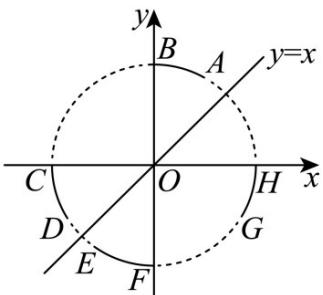

<!-- question-source:start -->
1. 如图，在平面直角坐标系中，AB，CD，EF，GH分别是单位圆上的四段弧（不含与坐标轴的交点），

点 $P$ 在其中一段上，角 $\alpha$ 以 $Ox$ 为始边， $OP$ 为终边，若 $\sin \alpha < \cos \alpha < \tan \alpha$ ，则 $P$ 所在的圆弧是（）

A. AB B. CD C. EF D. GH
<!-- question-source:end -->

![[高中/课堂同步/题库/人教A版高中数学同步讲义(2026)/01_必修第一册/第五章 三角函数/专题5.2 三角函数的概念（高效培优讲义）数学人教A版2019高一必修第一册/强化训练/questions/answers/Q00076275A1.md]]
