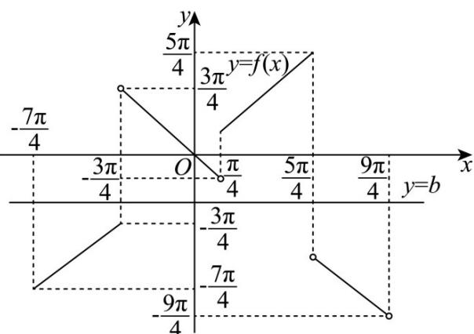

> [!faq]- 《专题5.2 三角函数的概念（高效培优讲义）数学人教A版2019高一必修第一册》官方解析
>
> > [!success]- **【答案】** A
>
> > [!note]- **【解析】**
> > 由题知 $\left\{ \begin{array}{l} \tan \alpha = \frac{\sin \alpha}{\cos \alpha} = 2 \\ \sin^2 \alpha + \cos^2 \alpha = 1, \alpha \in (0, \pi) \end{array} \right.$ ，解得 $\sin \alpha = \frac{2\sqrt{5}}{5}, \cos \alpha = \frac{\sqrt{5}}{5}$
> >
> > 则 $2\sin \alpha + \cos \alpha = 2 \times \frac{2\sqrt{5}}{5} + \frac{\sqrt{5}}{5} = \sqrt{5}$
> >
> > 故选：A.
> >
> > 9. “ $\alpha \in [0,2\pi]$ ，点 $P(\sin \alpha - \cos \alpha, \tan \alpha)$ 在第二象限”的一个充分不必要条件是 $\alpha \in (\quad)$ . A. $\left(\frac{\pi}{2}, \frac{3\pi}{4}\right) \cup \left(\pi, \frac{5\pi}{4}\right)$ B. $\left(0, \frac{\pi}{6}\right) \cup \left(\frac{5\pi}{4}, \frac{3\pi}{2}\right)$ C. $\left(\frac{\pi}{2}, \frac{3\pi}{4}\right) \cup \left(\frac{5\pi}{4}, \frac{3\pi}{2}\right)$ D. $\left(0, \frac{\pi}{4}\right) \cup \left(\frac{5\pi}{4}, \frac{3\pi}{2}\right)$
> >
> > 【答案】B
> >
> > 【详解】由题意有 $\left\{\begin{aligned}\sin\alpha-\cos\alpha<0\\\tan\alpha>0\\0\leq\alpha\leq2\pi\end{aligned}\right.\Rightarrow\left\{\begin{aligned}0<\alpha<\frac{\pi}{4}\text{或}\frac{5\pi}{4}<\alpha<2\pi\\0<\alpha<\frac{\pi}{2}\text{或}\pi<\alpha<\frac{3\pi}{2}\end{aligned}\right.\Rightarrow0<\alpha<\frac{\pi}{4}\text{或}\frac{5\pi}{4}<\alpha<\frac{3\pi}{2}$
> >
> > 所以“ $\alpha \in [0,2\pi]$ ，点 $P(\sin \alpha - \cos \alpha, \tan \alpha)$ 在第二象限”的一个充分不必要条件是 $\alpha \in \left(0, \frac{\pi}{6}\right) \cup \left(\frac{5\pi}{4}, \frac{3\pi}{2}\right)$ .
> >
> > 故选：B.
> >
> > 10. 函数 $f(x) = \begin{cases} x, \sin x & \cos x \\ -x, \sin x < \cos x \text{中}, P, M \text{为实数集} \mathbf{R} \text{的两个非空子集，又规定} f(P) = \left\{y \mid y = f(x), x \in P\right\} \end{cases}$
> >
> > $f(M)=\left\{y\mid y=f(x),x\in M\right\}$ ，给出下列四个判断：
> > - **①**：函数 $f(x)$ 有奇偶性；
> > - **②**：函数 $f(x)$ 为周期函数；
> > - **③**：存在无数条直线，与函数 $f(x)$ 的图象无公共点；
> > - **④**：若 $P \cap M = \emptyset$ ，则 $f(P) \cap f(M) = \emptyset$ ；
> > - **⑤**：若 $P \cup M = \mathbb{R}$ ，则 $f(P) \cup f(M) = \mathbf{R}$ .
> >
> > 其中正确判断的个数为（ ）A.1个 B.2个 C.3个 D.4个
> >
> > 【答案】A
> >
> > 【详解】由 $\sin x\quad \cos x$ ，可得 $\frac{\pi}{4} +2k\pi \leq x\leq \frac{5\pi}{4} +2k\pi ,k\in \mathbb{Z}$
> >
> > 又由 $\sin x < \cos x$ ，可得 $-\frac{3\pi}{4} + 2k\pi \leq x \leq \frac{5}{4} + 2k\pi, k \in \mathbb{Z}$
> >
> > 可得函数 $f(x) = \left\{ \begin{array}{ll}x,x\in [\frac{\pi}{4} +2k\pi ,\frac{5\pi}{4} +2k\pi ],k\in Z\\ -x,x\in (-\frac{3\pi}{4} +2k\pi ,\frac{\pi}{4} +2k\pi ),k\in Z \end{array} \right.$
> > - **对于①**：中，画出函数 $y = f(x)$ 在 $(- \frac{3\pi}{4}, \frac{5\pi}{4}]$ 的图象，如图所示，
> >
> > 结合图象，可得函数 $y = f(x)$ 的图象既不关于原点对称，也不关于 $y$ 轴对称，
> >
> > 所以函数 $y = f(x)$ 没有奇偶性，所以①不正确；
> > - **对于②**：中，假设函数 $y = f(x)$ 是周期函数，设 $T$ 是一个大于0的周期，
> >
> > 则 $f(nT)=f(0)=0$ ，其中 $n=1,2,\cdots$ ，这表明 $f(0)=0$ 有无数多个解，
> >
> > 但当 $x \neq 0$ 时， $\left|f(x)\right| = |x| > 0$ ，所以 $f(x) \neq 0$ ，从而 $f(0) = 0$ 至多有一个解，
> >
> > 所以函数 $y = f(x)$ 不周期函数，所以②不正确；
> > - **对于③**：中，结合 $y = f(x)$ 的图象，可得的图象不是连续的，
> >
> > 例如：当 $y = b, b \in \left(-\frac{3\pi}{4}, -\frac{\pi}{4}\right)$ 时直线 $y = b$ 与函数 $y = f(x)$ 没有公共点，
> >
> > 所以存在无数条直线，与函数 $f(x)$ 的图象无公共点，所以③正确；
> > - **对于④**：中，若 $P = \{1\} ,M = \{-1\}$ ，则满足 $P\cap M = \emptyset$ ，此时 $f(P) = \{1\} ,f(M) = \{1\}$
> >
> > 可得 $f(P) \cap f(M) = \{1\} \neq \varnothing$ ，所以④不正确；
> > - **对于⑤**：中，设 $P = \mathrm{R}, M = \mathrm{R}$ ，则 $P \cup M = \mathrm{R}$
> >
> > 此时 $f(P), f(M)$ 都是函数 $f(x)$ 的值域，则 $f(P) \cup f(M)$ 也是函数的值域，
> >
> > 而 $f(-\frac{\pi}{2}) = f(\frac{\pi}{2}) = \frac{\pi}{2}$ ，可得 $f(x) = -\frac{\pi}{2}$ 无解，所以函数 $f(x)$ 的值域不是 $\mathbb{R}$
> >
> > 所以⑤不正确·
> >
> > 故选：A.
> >
> > 
