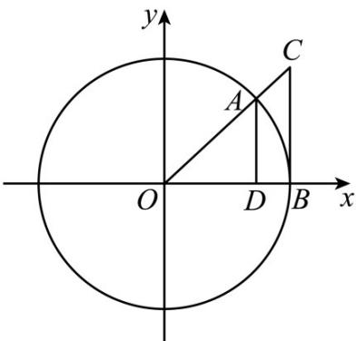

> [!faq]- 《专题5.2 三角函数的概念（高效培优讲义）数学人教A版2019高一必修第一册》官方解析
>
> > [!success]- **【答案】** A
>
> > [!note]- **【解析】**
> > 如下图示，在单位圆中 $\alpha = \angle AOB$ ， $AD \perp x$ 轴， $CB \perp x$ 轴，且 OA = OB = 1
> >
> > 
> >
> > 所以 $\alpha = AB$ ， $\sin\alpha = AD$ ， $\tan\alpha = CB$
> >
> > VAOB 的面积 $S_{\triangle AOB} = \frac{1}{2} \cdot AD \cdot OB = \frac{1}{2} \sin \alpha$
> >
> > 扇形 $AOB$ 的面积 $S_{AOB} = \frac{1}{2}\cdot AB\cdot OB = \frac{1}{2}\alpha$
> >
> > △ COB 的面积 $S_{\triangle COB} = \frac{1}{2} \cdot CB \cdot OB = \frac{1}{2} \tan \alpha$
> >
> > 由图知： $S_{\triangle AOB} <   S_{AOB} <   S_{\triangle COB}$
> >
> > 故 $\sin\alpha<\alpha<\tan\alpha$
> >
> > 故选：A.
> >
> > ## 方法技巧
> >
> > 三角函数值在各象限内的符号也可以用下面的口诀记忆：
> >
> > “一全正二正弦，三正切四余弦”，意为：第一象限各个三角函数均为正；第二象限只有正弦为正，其余两个
> >
> > 为负；第三象限正切为正，其余两个为负；第四象限余弦为正，其余两个为负。
