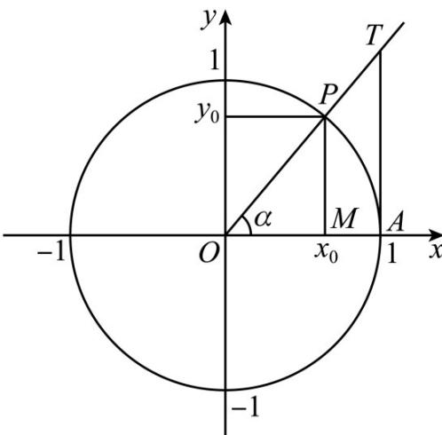

> [!faq]- 《专题5.2 三角函数的概念（高效培优讲义）数学人教A版2019高一必修第一册》官方解析
>
> > [!success]- **【答案】** A
>
> > [!note]- **【解析】**
> > 设角 $\alpha$ 与单位圆的交点为 $P(x_{0}, y_{0})$
> >
> > 因为 $0 < \alpha < \frac{\pi}{2}$ ，所以 $x_0 > 0, y_0 > 0$ ，
> >
> > 所以 $x_0 = |OM|, y_0 = |MP|$
> >
> > 过点 P 作 x 轴的垂线，垂足为 M ，
> >
> > 过点 $A(1,0)$ 作 x 轴的垂线交角 $\alpha$ 的终边与点 T，
> >
> > 因为 $\angle MOP = \angle AOT, \angle OMP = \angle OAT$
> >
> > 所以 $\triangle OMP\sim \triangle OAT$ ，所以 $\frac{|MP|}{|OM|} = \frac{|AT|}{|OA|} = |AT|$
> >
> > 所以 $\sin\alpha=y_{0}=\left|MP\right|$ ， $\tan\alpha=\frac{y_{0}}{x_{0}}=\frac{\left|MP\right|}{\left|OM\right|}=\left|AT\right|$
> >
> > 又弧 $AP$ 的长度为 $\alpha \times 1 = \alpha$
> >
> > 因为 $\left|MP\right|<\alpha<\left|AT\right|$
> >
> > 所以 $\sin \alpha < \alpha < \tan \alpha$
> >
> > 故选：A.
> >
> > 
