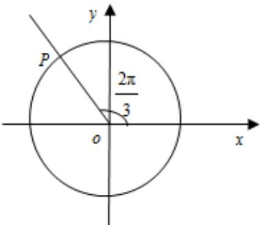

<!-- question-source:start -->
【典例1】如图，一个质点在半径为 $^{1}$ 的圆 $^{O}$ 上以点 $^{P}$ 为起始点，沿逆时针方向旋转，每 $^{2s}$ 转一圈，由该质

点到 $x$ 轴的距离 $y$ 关于时间 $t$ 的函数解析式是（）

A. $y = \left|\sin (\pi t + \frac{2\pi}{3})\right|$

B. $y = \left| \sin(\pi t - \frac{2\pi}{3}) \right|$

C. $y = \sin(\pi t - \frac{2}{3}\pi)$

D. $y = \sin(\pi t + \frac{2}{3}\pi)$
<!-- question-source:end -->

![[高中/课堂同步/题库/人教A版高中数学同步讲义(2026)/01_必修第一册/第五章 三角函数/专题5.2 三角函数的概念（高效培优讲义）数学人教A版2019高一必修第一册/题型05_圆上的动点与旋转点/questions/answers/Q00076252A1.md]]
