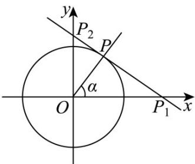

<!-- question-source:start -->
【变式2】如图，在平面直角坐标系中，锐角 $\alpha$ 的始边与 $x$ 轴的非负半轴重合，终边与单位圆（圆心在原点，

半径为1）交于点 $P$ 、过点 $P$ 作圆 $O$ 的切线，分别交 $x$ 轴、 $y$ 轴于点 $P_{1}(x_{0},0)$ 与 $P_{2}(0,y_{0})$

(1)若 $\alpha = \frac{\pi}{6}$ ，求 $P$ 的坐标

(2)若 $\triangle OP_{1}P_{2}$ 的面积为 $2$ ，求 $\tan \alpha$ 的值；

(3)求 $x_0^2 + 9y_0^2$ 的最小值.
<!-- question-source:end -->

![[高中/课堂同步/题库/人教A版高中数学同步讲义(2026)/01_必修第一册/第五章 三角函数/专题5.2 三角函数的概念（高效培优讲义）数学人教A版2019高一必修第一册/题型05_圆上的动点与旋转点/questions/answers/Q00076254A1.md]]
