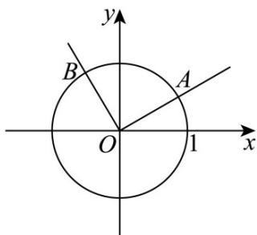

<!-- question-source:start -->
【变式3】如图，在平面直角坐标系 $xoy$ 中，锐角 $\alpha$ 的终边与单位圆交于点 $A\left(\frac{\sqrt{3}}{2},\frac{1}{2}\right)$ ，射线 $OA$ 绕点 $O$ 按逆

时针方向旋转 $\theta$ 后交单位圆于点 $B$ ，点 $B$ 的横坐标为 $f(\theta)$ ：

(1)求 $f(\theta)$ 的表达式，并求 $f\left(\frac{2\pi}{3}\right)$ 的值；

(2)若 $f\left(\theta -\frac{\pi}{6}\right) = \frac{1}{3},\theta \in (-\pi ,0)$ ，求 $\tan \theta$ 的值
<!-- question-source:end -->

![[高中/课堂同步/题库/人教A版高中数学同步讲义(2026)/01_必修第一册/第五章 三角函数/专题5.2 三角函数的概念（高效培优讲义）数学人教A版2019高一必修第一册/题型05_圆上的动点与旋转点/questions/answers/Q00076255A1.md]]
