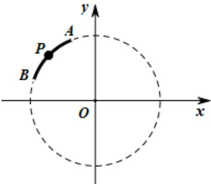

> [!faq]- 《专题5.2 三角函数的概念（高效培优讲义）数学人教A版2019高一必修第一册》官方解析
>
> > [!success]- **【答案】** 始边， $OP$ 为终边．以下结论正确的是（）  A. $\tan \alpha < \cos \alpha < \sin \alpha$ B. $\cos \alpha < \tan \alpha < \sin \alpha$ C. $\sin \alpha < \cos \alpha < \tan \alpha$ D. 以上答案都不对
>
> > [!note]- **【解析】**
> > 由题设可得 $\mathbb{A}B$ 上的动点 $P$ 的坐标为 $(\cos \alpha, \sin \alpha)$ 且 $A(\cos \theta_1, \sin \theta_1), B(\cos \theta_2, \sin \theta_2)$
> >
> > 其中 $\frac{\pi}{2} < \theta_1 < \alpha < \theta_2 < \pi$ ， $\frac{\pi}{2} < \theta_1 < \frac{3\pi}{4} < \theta_2 < \pi$
> >
> > 注意到当 $\alpha \in \left(\theta_1, \frac{3\pi}{4}\right]$ ， $\tan \alpha \leq -1$ ，故按如下分类讨论：
> >
> > 若 $\frac{\pi}{2} < \theta_1 < \alpha \leq \frac{3\pi}{4}$ ，则 $\sin \alpha > 0, \cos \alpha > -1, \tan \alpha \leq -1$ ，
> >
> > 故 $\sin \alpha >\cos \alpha >\tan \alpha$
> >
> > 若 $\frac{3\pi}{4} < \alpha \leq \theta_{2}$ ，则 $\sin \alpha > 0, \cos \alpha < 0, \tan \alpha < 0$ ，且 $0 < \sin \theta_{2} \leq \sin \alpha < \frac{\sqrt{2}}{2}$
> >
> > 所以 $\sin^2\theta_2 + \sin \theta_2 - 1\leq \sin^2\alpha +\sin \alpha -1 <   \frac{\sqrt{2} - 1}{2}$
> >
> > 因为 $\frac{3\pi}{4}<\theta_{2}<\pi$ ，故 $0<\sin\theta_{2}<\frac{\sqrt{2}}{2}$ ，故 $-1<\sin^{2}\theta_{2}+\sin\theta_{2}-1<\frac{\sqrt{2}-1}{2}$ ，
> >
> > 所以 $\sin^{2}\theta_{2}+\sin\theta_{2}-1$ 有正有负，所以 $\sin^{2}\alpha+\sin\alpha-1$ 有正有负，
> >
> > 而 $\tan \alpha -\cos \alpha = \frac{\sin^2\alpha + \sin\alpha - 1}{\cos\alpha}$ ， $\cos \alpha < 0$ ，故 $\tan \alpha -\cos \alpha$ 有正有负，
> >
> > 故 $\tan\alpha,\cos\alpha$ 大小关系不确定·
> >
> > 故选 **D**.
