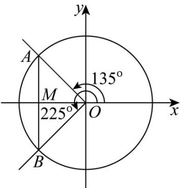

> [!faq]- 《专题5.2 三角函数的概念（高效培优讲义）数学人教A版2019高一必修第一册》官方解析
>
> > [!success]- **【答案】** $\sqrt{10}$ ； $-\frac{3\sqrt{10}}{5}$ ； $\left\{x\mid 135^{\circ} + k\cdot 360^{\circ}\leq x\leq 225^{\circ} + k\cdot 360^{\circ},k\in \mathbb{Z}\right\}$
>
> > [!note]- **【解析】**
> > （1）设 $P(x,y)$ ，则有 $\frac{x}{y} = -\frac{1}{3}$ ，即 $\tan \alpha = \frac{y}{x} = -3$
> >
> > 所以 $\left\{\begin{aligned}\tan\alpha&=\frac{\sin\alpha}{\cos\alpha}=-3\\\sin^{2}\alpha+\cos^{2}\alpha&=1\end{aligned}\right.\Rightarrow\cos^{2}\alpha=\frac{1}{10}$ ，又 $\alpha$ 为第二象限角，
> >
> > 所以 $\cos \alpha = -\frac{\sqrt{10}}{10}$ ， $\sin \alpha = \frac{3\sqrt{10}}{10}$
> >
> > 所以 $3\sin\alpha - \cos\alpha = 3 \times \frac{3\sqrt{10}}{10} - \left(-\frac{\sqrt{10}}{10}\right) = \sqrt{10}$
> >
> > (2) 设 $P(x, y)$ ，则有 $\left|\frac{y}{x}\right| = \frac{1}{3}$ ，由 $\alpha$ 为第四象限角，
> >
> > 所以 $\frac{y}{x} = -\frac{1}{3}$ ，即 $\tan \alpha = \frac{y}{x} = -\frac{1}{3}$
> >
> > 所以 $\left\{\begin{aligned}\tan\alpha&=\frac{\sin\alpha}{\cos\alpha}=-\frac{1}{3}\Rightarrow\sin\alpha=-\frac{\sqrt{10}}{10},\cos\alpha=\frac{3\sqrt{10}}{10}\\ \sin^{2}\alpha+\cos^{2}\alpha=1\end{aligned}\right.$
> >
> > 所以 $3\sin\alpha - \cos\alpha = 3 \times \left(-\frac{\sqrt{10}}{10}\right) - \frac{3\sqrt{10}}{10} = -\frac{3\sqrt{10}}{5}$ ;
> >
> > (3) 由 $\cos x = -\frac{\sqrt{2}}{2}$ ，得 $x = 135^{\circ} + k \cdot 360^{\circ}, k \in \mathbb{Z}$ 或 $x = 225^{\circ} + k \cdot 360^{\circ}, k \in \mathbb{Z}$ .
> >
> > 由 $\cos x \leq -\frac{\sqrt{2}}{2}$ 得 $135^{\circ} + k \cdot 360^{\circ} \leq x \leq 225^{\circ} + k \cdot 360^{\circ}, k \in Z$
> >
> > 所以原不等式的解集为 $\left\{x\mid 135^{\circ} + k\cdot 360^{\circ}\leq x\leq 225^{\circ} + k\cdot 360^{\circ},k\in \mathbb{Z}\right\}$
> >
> > 
