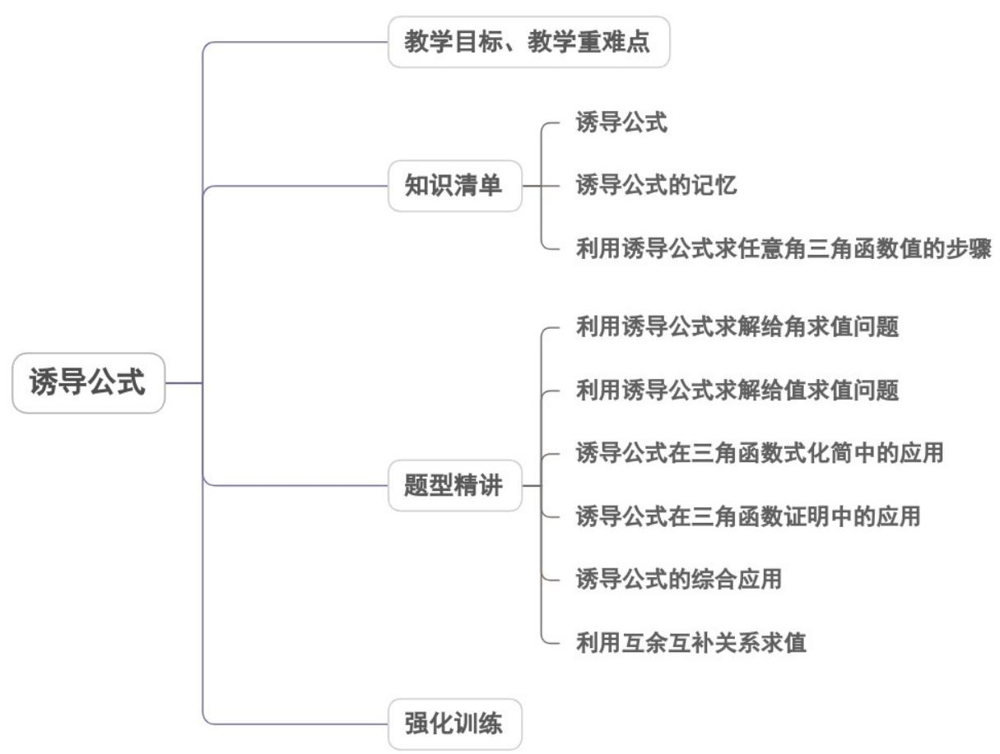
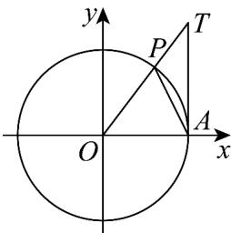

<!-- source-part:1 pages:1-40 -->

专题5.3 诱导公式

## 教学目标、教学重难点

<table><tr><td>教学目标</td><td>1.掌握诱导公式的内容、规律适用范围。2.了解诱导公式的作用。3.会用诱导公式进行化简、求值、证明恒等式。</td></tr><tr><td>教学重难点</td><td>1.重点:理解与掌握诱导公式的内容,会用诱导公式进行相关的运算2.难点:会用诱导公式进行化简、求值、证明恒等式。</td></tr></table>

## 知识清单

## 知识点 01 诱导公式

诱导公式一： $\sin (\alpha +2k\pi) = \sin \alpha$ ， $\cos (\alpha +2k\pi) = \cos \alpha$ ， $\tan (\alpha +2k\pi) = \tan \alpha$ ，其中 $k\in Z$

诱导公式二： $\sin (-\alpha) = -\sin \alpha$ ， $\cos (-\alpha) = \cos \alpha$ ， $\tan (-\alpha) = -\tan \alpha$ ，其中 $k\in Z$

诱导公式三： $\sin [(\alpha +(2k + 1)\pi ] = -\sin \alpha$ ， $\cos [\alpha +(2k + 1)\pi ] = -\cos \alpha$ ， $\tan [\alpha +(2k + 1)\pi ] = \tan \alpha$ ，其中 $k\in Z$

诱导公式四： $\sin \left(\frac{\pi}{2} +\alpha\right) = \cos \alpha$ ， $\cos \left(\frac{\pi}{2} +\alpha\right) = -\sin \alpha$ ， $\sin \left(\frac{\pi}{2} -\alpha\right) = \cos \alpha$ ， $\cos \left(\frac{\pi}{2} -\alpha\right) = \sin \alpha$ ，其中

$k\in Z$

【即学即练】

1. 设 $a = \sin 3.1$ ， $b = -\tan 3$ ， $c = \pi - 3$ ，则（）A. $b < c < a$ B. $b < a < c$ C. $a < c < b$ D. $a < b < c$

【答案】C

【详解】由三角函数线可得当 $\alpha\in\left(0,\frac{\pi}{2}\right)$ 时， $\sin\alpha<\alpha<\tan\alpha$

又 $a = \sin 3.1 = \sin (\pi -3.1)$

所以 $\sin(\pi-3.1)<\pi-3.1<\pi-3<\tan(\pi-3)=-\tan3$ ，所以 a<c<b。

故选：C.

其中当 $0 < x < \frac{\pi}{2}$ 时 $\sin x < x < \tan x$ 的证明如下：

构造单位圆 $\odot O$ ，如图所示：

则 $A(1,0)$ ，设 $\angle POA = x\in \left(0,\frac{\pi}{2}\right)$ ，则 $P(\cos x,\sin x)$

过点 A 作直线 AT 垂直于 x 轴，交 OP 所在直线于点 T，

由 $\frac{AT}{OA} = \tan x$ ，得 $AT = \tan x$ ，所以 $T(1,\tan x)$

由图可知 $S_{\triangle OPA} < S_{\text{扇形}OPA} < S_{\triangle TOA}$

即 $\frac{1}{2} \times 1 \times \sin x < \frac{1}{2} \times 1^2 \times x < \frac{1}{2} \times 1 \times \tan x$ 即 $\sin x < x < \tan x$ .

2. 已知角 $\theta$ 的终边经过点 $\left(3, -\sqrt{7}\right)$ ，则 $\tan (\theta + \pi) + \cos (\theta - \frac{3\pi}{2}) =$ （ ）A. $-\frac{7\sqrt{7}}{12}$ B. $\frac{7\sqrt{7}}{12}$ C. $-\frac{\sqrt{7}}{12}$ D. $\frac{\sqrt{7}}{12}$

【答案】C

【详解】依题意，角 $\theta$ 的终边经过点 $(3, -\sqrt{7})$ ，则 $\tan \theta = -\frac{\sqrt{7}}{3}, \sin \theta = \frac{-\sqrt{7}}{\sqrt{3^2 + (-\sqrt{7})^2}} = \frac{-\sqrt{7}}{4}$ 于是 $\tan (\theta + \pi) + \cos (\theta - \frac{3\pi}{2}) = \tan \theta - \sin \theta = -\frac{\sqrt{7}}{3} + \frac{\sqrt{7}}{4} = -\frac{\sqrt{7}}{12}$ .

故选：C.

诱导公式一～三可用口诀“函数名不变，符号看象限”记忆，其中“函数名不变”是指等式两边的三角函数同名，

“符号”是指等号右边是正号还是负号，“看象限”是指把 $\alpha$ 看成锐角时原三角函数值的符号。

诱导公式四可用口诀“函数名改变，符号看象限”记忆，“函数名改变”是指正弦变余弦，余弦变正弦，为了记忆

方便，我们称之为函数名变为原函数的余名三角函数。“符号看象限”同上。

因为任意一个角都可以表示为 $k \cdot 90^{\circ} + \alpha (|\alpha| < 45^{\circ})$ 的形式，所以这六组诱导公式也可以统一用“口诀”：“奇变

偶不变，符号看象限”，意思是说角 $k \cdot 90^{\circ} \pm \alpha$ （ $k$ 为常整数）的三角函数值：当 $k$ 为奇数时，正弦变余弦，余

弦变正弦；当 $k$ 为偶数时，函数名不变，然后 $\alpha$ 的三角函数值前面加上当视 $\alpha$ 为锐角时原函数值的符号。

用诱导公式进行化简时的注意点：

(1) 化简后项数尽可能的少；

(2) 函数的种类尽可能的少；

(3) 分母不含三角函数的符号；

(4) 能求值的一定要求值；

(5) 含有较高次数的三角函数式，多用因式分解、约分等.

## 【即学即练】

1. 已知 $\alpha \in \left(\frac{\pi}{2}, \pi\right)$ ，若 $\cos \left(\frac{\pi}{6} - \alpha\right) = \frac{\sqrt{2}}{3}$ ，则 $\sin \left(\alpha + \frac{5\pi}{6}\right)$ 的值为（ ）A. $\frac{\sqrt{2}}{3}$ B. $-\frac{\sqrt{2}}{3}$ C. $\frac{\sqrt{7}}{3}$ D. $-\frac{\sqrt{7}}{3}$

【答案】D

【详解】 $\because \frac{\pi}{2} <  \alpha <  \pi ,\therefore -\pi <  -\alpha <  -\frac{\pi}{2},$

$$
\therefore \frac {\pi}{6} - \alpha \in \left(- \frac {5 \pi}{6}, - \frac {\pi}{3}\right)
$$

$$
\because \cos \left(\frac {\pi}{6} - \alpha\right) = \frac {\sqrt {2}}{3}, \text {又} \frac {\pi}{6} - \alpha \in \left(- \frac {5 \pi}{6}, - \frac {\pi}{3}\right),
$$

$$
\therefore \sin \left(\frac {\pi}{6} - \alpha\right) = - \sqrt {1 - \cos^ {2} \left(\frac {\pi}{6} - \alpha\right)} = - \frac {\sqrt {7}}{3}
$$

$$
\sin \left(\alpha + \frac {5 \pi}{6}\right) = \sin \left[ \pi - \left(\frac {\pi}{6} - \alpha\right) \right] = \sin \left(\frac {\pi}{6} - \alpha\right) = - \frac {\sqrt {7}}{3}
$$

故选：D.

2. 在VABC中，下列关系式正确的是（ ）

【答案】
A. $\sin\frac{A+B}{2}=\sin\frac{C}{2}$ B. $\cos\frac{A+B}{2}=\sin\frac{C}{2}$ C. $\tan(A+B)=\tan C$ D. $\cos(A+B)=\cos C$

【答案】B

【详解】已知 $A + B + C = \pi$ ，则 $A + B = \pi -C$ ，那么 $\frac{A + B}{2} = \frac{\pi}{2} -\frac{C}{2}$

根据诱导公式 $\sin\left(\frac{\pi}{2}-\alpha\right)=\cos\alpha,\quad$ 可得 $\sin\frac{A+B}{2}=\sin\left(\frac{\pi}{2}-\frac{C}{2}\right)=\cos\frac{C}{2}\neq\sin\frac{C}{2}$

所以 A 选项错误·

由上述可知 $\frac{A+B}{2}=\frac{\pi}{2}-\frac{C}{2}$

根据诱导公式 $\cos \left(\frac{\pi}{2} -\alpha\right) = \sin \alpha$ ，可得 $\cos \frac{A + B}{2} = \cos \left(\frac{\pi}{2} -\frac{C}{2}\right) = \sin \frac{C}{2}$

所以 B 选项正确·

因为 $A + B = \pi - C$ .

根据诱导公式 $\tan (\pi -\alpha) = -\tan \alpha$ ，可得 $\tan (A + B) = \tan (\pi -C) = -\tan C\neq \tan C$

所以 C 选项错误·

由于 $A + B = \pi - C$ .

根据诱导公式 $\cos(\pi-\alpha)=-\cos\alpha$ ，可得 $\cos(A+B)=\cos(\pi-C)=-\cos C\neq\cos C$

所以 $^{D}$ 选项错误·

故选：B.

## 知识点03 利用诱导公式求任意角三角函数值的步骤

用诱导公式可将任意角的三角函数化为锐角的三角函数，其一般方向是：

①化负角的三角函数为正角的三角函数；

②化为 $[0,2\pi]$ 内的三角函数；

③化为锐角的三角函数.

可概括为：“负化正，大化小，化到锐角为终了”（有时也直接化到锐角求值）.

【即学即练】

$$
\cos (\pi + \alpha) - \sin (- \alpha)
$$

1. 设 $\tan(5\pi+\alpha)=2\left(\alpha\neq k\pi+\frac{\pi}{2},k\in\mathbb{Z}\right)$ ，则 $\overline{\sin(\pi-\alpha)+\sin\left(\frac{\pi}{2}+\alpha\right)}$ 的值为（）

【答案】
A. $\frac{1}{3}$ B. $-\frac{1}{3}$ C.-1 D.1

【答案】A

【详解】 $\tan (5\pi +\alpha) = 2\left(\alpha \neq k\pi +\frac{\pi}{2},k\in \mathbb{Z}\right)$

$$
\therefore \tan \alpha = 2
$$

$$
\frac {\cos (\pi + \alpha) - \sin (- \alpha)}{\sin (\pi - \alpha) + \sin \left(\frac {\pi}{2} + \alpha\right)} = \frac {- \cos \alpha + \sin \alpha}{\sin \alpha + \cos \alpha} = \frac {- 1 + \tan \alpha}{\tan \alpha + 1} = \frac {- 1 + 2}{2 + 1} = \frac {1}{3}
$$

故选：A.

2. 若 $\tan \theta = -3$ ，则 $\sin (3\pi - \theta) \sin \left( \frac{5\pi}{2} + \theta \right) = (\quad)$ A. $-\frac{2}{5}$ B. $-\frac{3}{10}$ C. $\frac{3}{10}$ D. $\frac{2}{5}$

【答案】B

【详解】因 $\sin(3\pi-\theta)\sin\left(\frac{5\pi}{2}+\theta\right)=\sin\theta\cos\theta=\frac{\sin\theta\cos\theta}{\sin^{2}\theta+\cos^{2}\theta}=\frac{\tan\theta}{\tan^{2}\theta+1}=\frac{-3}{(-3)^{2}+1}=-\frac{3}{10}$

故选：B

## 题型精讲

![[高中/课堂同步/题库/人教A版高中数学同步讲义(2026)/01_必修第一册/第五章 三角函数/专题5.3 诱导公式（高效培优讲义）数学人教A版2019高一必修第一册/题型01_利用诱导公式求解给角求值问题/题型01_利用诱导公式求解给角求值问题.md]]
![[高中/课堂同步/题库/人教A版高中数学同步讲义(2026)/01_必修第一册/第五章 三角函数/专题5.3 诱导公式（高效培优讲义）数学人教A版2019高一必修第一册/题型02_利用诱导公式求解给值求值问题/题型02_利用诱导公式求解给值求值问题.md]]
![[高中/课堂同步/题库/人教A版高中数学同步讲义(2026)/01_必修第一册/第五章 三角函数/专题5.3 诱导公式（高效培优讲义）数学人教A版2019高一必修第一册/题型03_诱导公式在三角函数式化简中的应用/题型03_诱导公式在三角函数式化简中的应用.md]]
![[高中/课堂同步/题库/人教A版高中数学同步讲义(2026)/01_必修第一册/第五章 三角函数/专题5.3 诱导公式（高效培优讲义）数学人教A版2019高一必修第一册/题型04_诱导公式在三角函数证明中的应用/题型04_诱导公式在三角函数证明中的应用.md]]
![[高中/课堂同步/题库/人教A版高中数学同步讲义(2026)/01_必修第一册/第五章 三角函数/专题5.3 诱导公式（高效培优讲义）数学人教A版2019高一必修第一册/题型05_诱导公式的综合应用/题型05_诱导公式的综合应用.md]]
![[高中/课堂同步/题库/人教A版高中数学同步讲义(2026)/01_必修第一册/第五章 三角函数/专题5.3 诱导公式（高效培优讲义）数学人教A版2019高一必修第一册/题型06_利用互余互补关系求值/题型06_利用互余互补关系求值.md]]
![[高中/课堂同步/题库/人教A版高中数学同步讲义(2026)/01_必修第一册/第五章 三角函数/专题5.3 诱导公式（高效培优讲义）数学人教A版2019高一必修第一册/强化训练/强化训练.md]]
