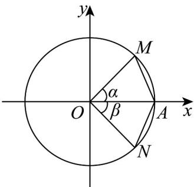

<!-- question-source:start -->
20. 如图，在平面直角坐标系 $xOy$ 中，以原点 $O$ 为顶点， $x$ 轴非负半轴为始边作角 $\alpha$ 与 $\beta (-\frac{\pi}{2} < \beta < 0$

$< \alpha < \frac{\pi}{2})$ ，它们的终边分别与以 $O$ 为圆心的单位圆相交于点 $M, N$ ，且点 $M$ 的坐标为 $\left(\frac{3}{5}, y\right)$ ，单位圆与 $x$ 轴的

非负半轴交于点 $\mathrm{A}$ ， $\triangle OAN$ 的面积是 $\triangle OAM$ 面积的 $\frac{3}{4}$

(1)求 $\sin \alpha, \cos \alpha$ 的值；

$$
\sin (- \beta) + \cos (\beta - \pi)
$$

(2)求 $\cos \left(-\beta +\frac{5\pi}{2}\right)\sin \left(\frac{3\pi}{2} -\beta\right)$ 的值.
<!-- question-source:end -->

![[高中/课堂同步/题库/人教A版高中数学同步讲义(2026)/01_必修第一册/第五章 三角函数/专题5.3 诱导公式（高效培优讲义）数学人教A版2019高一必修第一册/强化训练/questions/answers/Q00076328A1.md]]
