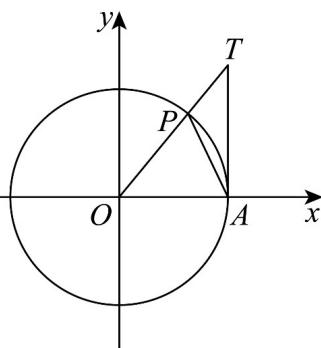

> [!faq]- 《专题5.3 诱导公式（高效培优讲义）数学人教A版2019高一必修第一册》官方解析
>
> > [!success]- **【答案】** B
>
> > [!note]- **【解析】**
> > 当 $0 < x < \frac{\pi}{2}$ 时， $\sin x < x < \tan x$
> >
> > 
> >
> > 在单位圆 $\odot O$ 中，点 $A(1,0)$ ，设 $\angle POA = x \in (0, \frac{\pi}{2})$ ，则 $P(\cos x, \sin x)$ ，
> >
> > 过点 A 作直线 AT 垂直于 x 轴，交 OP 所在直线于点 T，
> >
> > 由 $\frac{|AT|}{|OA|} = \tan x$ ，得 $|AT| = \tan x$
> >
> > 设扇形 OPA 的面积为 S，
> >
> > 由图知 $S_{\triangle OPA} < S < S_{\triangle TOA}$ ，即 $\frac{1}{2} \times 1 \times \sin x < \frac{1}{2} \times 1^2 \cdot x < \frac{1}{2} \times 1 \times \tan x$
> >
> > 即 $\sin x < x < \tan x$
> >
> > 对于 AC，由 $\forall x\in(0,\frac{\pi}{2})$ ，得 $\sin x<x<\tan x$ ，AC 正确；
> >
> > 对于 B， $\forall x\in(0,\frac{\pi}{2})$ ，得 $\frac{\pi}{2}-x\in(0,\frac{\pi}{2})$ ，则 $x+\cos x=x+\sin(\frac{\pi}{2}-x)<x+\frac{\pi}{2}-x=\frac{\pi}{2}$ ，B 错误；
> >
> > 对于 $^{D}$ ，由 $\forall x\in(0,\frac{\pi}{2})$ ，则 $\frac{\pi}{2}-x\in(0,\frac{\pi}{2})$
> >
> > 则 $x + \frac{1}{\tan x} = x + \frac{\cos x}{\sin x} = x + \frac{\sin(\frac{\pi}{2} - x)}{\cos(\frac{\pi}{2} - x)} = x + \tan (\frac{\pi}{2} - x) > x + \frac{\pi}{2} - x = \frac{\pi}{2}$ ，D正确.
> >
> > 故选 **B**
