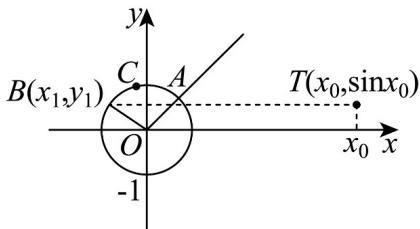

> [!faq]- 《专题5.3 诱导公式（高效培优讲义）数学人教A版2019高一必修第一册》官方解析
>
> > [!success]- **【答案】**  A. 若 $\angle AOB = \alpha$ ，且 $y_{1} = \sin x_{0}$ ，则 $x_{0} = \alpha + \frac{\pi}{4}$ B. 若 $y_{1} = \sin x_{0}$ ，则 $x_{1} = \cos \left(x_{0} + \frac{\pi}{4}\right)$ C. 若 $y_{1} = \sin x_{0}$ ，则 $\square ACB$ 所对圆心角为 $x_{0} - \frac{\pi}{4}$ D. 若 $\square ACB$ 所对圆心角为 $x_{0} - \frac{\pi}{4}$ ，则 $y_{1} = \sin x_{0}$
>
> > [!note]- **【解析】**
> > 如图，因为单位圆与射线 $y = x(x > 0)$ 交于点 A，
> > 即点 A 在角 $\frac{\pi}{4}$ 的终边上，
> > 设点 $B(x_{1},y_{1})$ 在角 $\beta$ 的终边上，则 $y_{1}=\sin\beta,\quad x_{1}=\cos\beta$ 对于 A，因为点 T 的坐标是 $(x_{0},\sin x_{0})$ 由题意可知 $y_{1}=\sin\beta=\sin x_{0}$ 如图，若 $\angle AOB = \alpha$ ，则 $\beta = \frac{\pi}{4} + \alpha + 2k\pi, k \in Z$ 即 $\sin x_{0} = \sin(\alpha + \frac{\pi}{4} + 2k\pi) = \sin(\alpha + \frac{\pi}{4})$
> >
> > 此时 $x_{0}=\frac{\pi}{4}+\alpha+2k\pi,k\in\mathbf{Z}$ 或 $x_{0}=(2k+1)\pi-\left(\frac{\pi}{4}+\alpha\right),k\in\mathbf{Z}$ ，故 A 错误；
> >
> > 对于 B，由题意可得 $y_{1} = \sin x_{0} = \sin \beta$
> >
> > 则 $x_0 = \beta + 2k\pi, k \in \mathbf{Z}$ 或 $x_0 = (2k + 1)\pi - \beta, k \in \mathbf{Z}$
> >
> > 故 $^{B}$ 错误；
> >
> > 对于 $C$ ，由图可知，设 $\square ACB$ 对应的圆心角为 $\alpha$ ，
> >
> > 由A项可知， $x_0 = \frac{\pi}{4} +\alpha +2k\pi ,k\in \mathbf{Z}$ 或 $x_0 = (2k + 1)\pi -\left(\frac{\pi}{4} +\alpha\right),k\in \mathbf{Z}$
> >
> > 即 $\alpha = x_{0} - \frac{\pi}{4} - 2k\pi$ 或 $(2k + 1)\pi - \frac{\pi}{4} - x_{0}, k \in \mathbf{Z}$
> >
> > 例如：当 $x_0 = \frac{9}{4}\pi$ 时，则 $B(\cos \frac{3}{4}\pi ,\sin \frac{3}{4}\pi)$ 满足 $y_{1} = \sin x_{0}$
> >
> > 此时 $\alpha=\frac{3}{4}\pi-\frac{\pi}{4}=\frac{\pi}{2}$ ，即此时 $\square ACB$ 对应的圆心角为 $\alpha=\frac{11}{4}\pi-x_{0}$ ，
> >
> > 而 $x_{0}-\frac{\pi}{4}=2\pi$ ，故 C 错误；
> >
> > 对于 D，若 $\square ACB$ 所对圆心角为 $x_{0}-\frac{\pi}{4}$ ，则 $\beta=\frac{\pi}{4}+x_{0}-\frac{\pi}{4}+2k\pi,k\in Z$
> >
> > 则 $y_{1}=\sin\left(\frac{\pi}{4}+x_{0}-\frac{\pi}{4}+2k\pi\right)=\sin x_{0}$ ，故 D 正确.
> >
> > 故选 **D**.
