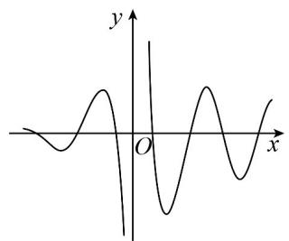
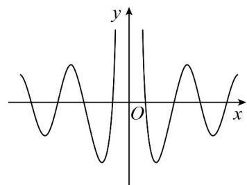
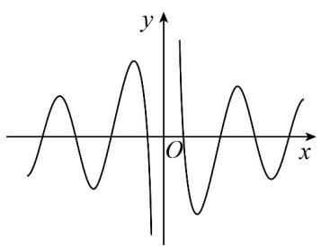
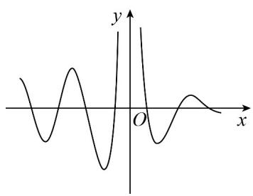

> [!faq]- 《专题5.3 诱导公式（高效培优讲义）数学人教A版2019高一必修第一册》官方解析
>
> > [!success]- **【答案】** B
>
> > [!note]- **【解析】**
> > 由题意设 $\cos\left(\beta+\frac{\pi}{6}\right)=\sin\alpha$ ，因为 $0<\beta<\frac{\pi}{2}\Rightarrow\frac{\pi}{6}<\beta+\frac{\pi}{6}<\frac{2\pi}{3}$ 所以 $\sin\left(\beta+\frac{\pi}{6}\right)=\cos\alpha>0$ 所以 $\tan\alpha=\frac{1}{\tan\left(\beta+\frac{\pi}{6}\right)}$ $\tan(\alpha+\beta)=\frac{\tan\alpha+\tan\beta}{1-\tan\alpha\tan\beta}=\frac{\frac{1}{\tan\left(\beta+\frac{\pi}{6}\right)}+\tan\beta}{1-\frac{1}{\tan\left(\beta+\frac{\pi}{6}\right)}\tan\beta}=\frac{1+\tan\left(\beta+\frac{\pi}{6}\right)\tan\beta}{\tan\left(\beta+\frac{\pi}{6}\right)-\tan\beta}$ $=\frac{\cos\left(\beta+\frac{\pi}{6}\right)\cos\beta+\sin\left(\beta+\frac{\pi}{6}\right)\sin\beta}{\sin\left(\beta+\frac{\pi}{6}\right)\cos\beta-\cos\left(\beta+\frac{\pi}{6}\right)\sin\beta}=\frac{\cos\frac{\pi}{6}}{\sin\frac{\pi}{6}}=\sqrt{3}$
> >
> > 故选：B.
> >
> > 9. 函数 $f(x) = \frac{2^x \sin\left(\frac{\pi}{2} + 3x\right)}{2^x - 1}$ 的图象大致是（）
> >
> > 【答案】
> >
> > A.
> >
> > 
> >
> > B
> >
> > 
> >
> > C
> >
> > 
> >
> > D
> >
> > 
> >
> > 【答案】A
> >
> > 【详解】由题意得： $f(x)=\frac{2^{x}\sin\left(\frac{\pi}{2}+3x\right)}{2^{x}-1}=\frac{2^{x}\cos3x}{2^{x}-1}$
> >
> > 对于 BC，由 $f(-x)=\frac{2^{-x}\cos(-3x)}{2^{-x}-1}=\frac{\cos3x}{1-2^{x}}$ ，知 $f(-x)\neq f(x)$ ， $f(-x)\neq-f(x)$
> >
> > 可判断函数为非奇非偶函数，可知 BC 错误；
> >
> > 对于 AD，由 $f(-x)=\frac{\cos3x}{1-2^{x}}$ ，知 $f(-x)$ 与 $f(x)$ 异号，可知 D 错误；
> >
> > 故选 **A**
