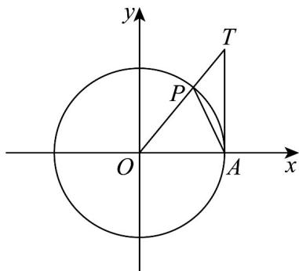

> [!faq]- 《专题5.3 诱导公式（高效培优讲义）数学人教A版2019高一必修第一册》官方解析
>
> > [!success]- **【答案】** ABD
>
> > [!note]- **【解析】**
> > 首先证明当 $0 < x < \frac{\pi}{2}$ 时 $\sin x < x < \tan x$ ，
> >
> > 构造单位圆 $\odot O$ ，如图所示：
> >
> > 
> >
> > 则 $A(1,0)$ ，设 $\angle POA = x\in \left(0,\frac{\pi}{2}\right)$ ，则 $P(\cos x,\sin x)$
> >
> > 过点 A 作直线 AT 垂直于 x 轴，交 OP 所在直线于点 T，
> >
> > 由 $\frac{|AT|}{|OA|}=\tan x$ ，得 $|AT|=\tan x$ ，所以 $T(1,\tan x)$ ，
> >
> > 由图可知 $S_{\triangle OPA} < S_{扇形OPA} < S_{\triangle TOA}$
> >
> > 即 $\frac{1}{2} \times 1 \times \sin x < \frac{1}{2} \times 1^2 \times x < \frac{1}{2} \times 1 \times \tan x$
> >
> > 即 $\sin x < x < \tan x$
> >
> > 对于 A、B：因为 $\forall x\in\left(0,\frac{\pi}{2}\right)$ ，易知 $\sin x<x<\tan x$ ，故 A、B 正确；
> >
> > 对于 $^{C}$ ：因为 $\forall x\in\left(0,\frac{\pi}{2}\right)$ ，则 $\frac{\pi}{2}-x\in\left(0,\frac{\pi}{2}\right)$
> >
> > 则 $x + \cos x = x + \sin \left(\frac{\pi}{2} - x\right) < x + \frac{\pi}{2} - x = \frac{\pi}{2}$
> >
> > 所以 $\forall x\in\left(0,\frac{\pi}{2}\right)$ ， $x+\cos x<\frac{\pi}{2}$ ，故 C 错误；
> >
> > 对于 $^{D}$ ：因为 $\forall x\in\left(0,\frac{\pi}{2}\right)$ ，则 $\frac{\pi}{2}-x\in\left(0,\frac{\pi}{2}\right)$
> >
> > 所以 $x + \frac{1}{\tan x} = x + \tan\left(\frac{\pi}{2} - x\right) > x + \frac{\pi}{2} - x = \frac{\pi}{2}$
> >
> > 即 $\forall x\in\left(0,\frac{\pi}{2}\right)$ ， $x+\frac{1}{\tan x}>\frac{\pi}{2}$ ，故 D 正确·
> >
> > 故选：ABD
> >
> > 12. 给出下列四个结论，其中正确的结论是（ ）
> >
> > 【答案】
> > A. $\sin(\pi+\alpha)=-\sin\alpha$ 成立的条件是角 $\alpha$ 是锐角
> > B. $-\frac{\pi}{9}$ 与 $\frac{17\pi}{9}$ 的终边相同
> > C. $\sin x = \frac{\sqrt{3}}{2}$ 的解集是 $\left\{x \mid x = \frac{\pi}{3} + k\pi, k \in Z\right\}$ D. 若 $\alpha$ 是第二象限角，则 $\frac{\alpha}{2}$ 为第一象限或第三象限角
> >
> > 【答案】BD
> >
> > 【详解】对于 A，根据诱导公式， $\alpha\in R$ 时， $\sin(\pi+\alpha)=-\sin\alpha$ ，故 A 错误；
> >
> > 对于 B， $\frac{17\pi}{9}=-\frac{\pi}{9}+2\pi$ ，所以 $-\frac{\pi}{9}\frac{17\pi}{9}$ 的终边相同，故 B 正确；
> >
> > 对于 $C$ ，由 $\sin x = \frac{\sqrt{3}}{2}$ 可得 $x = \frac{\pi}{3} + 2k\pi$ 或 $x = \frac{2\pi}{3} + 2k\pi, k \in Z$ ，故 $C$ 错误；
> >
> > 对于 $\mathbb{D}$ ，若 $\alpha$ 是第二象限角，则 $\alpha \in \left(\frac{\pi}{2} + 2k\pi, \pi + 2k\pi\right), k \in \mathbb{Z}$
> >
> > 所以 $\frac{\alpha}{2} \in \left( \frac{\pi}{4} + k\pi, \frac{\pi}{2} + k\pi \right), k \in \mathbb{Z}$ ，是第一象限或第三象限角，故D正确·
> >
> > 故选 **BD**.
