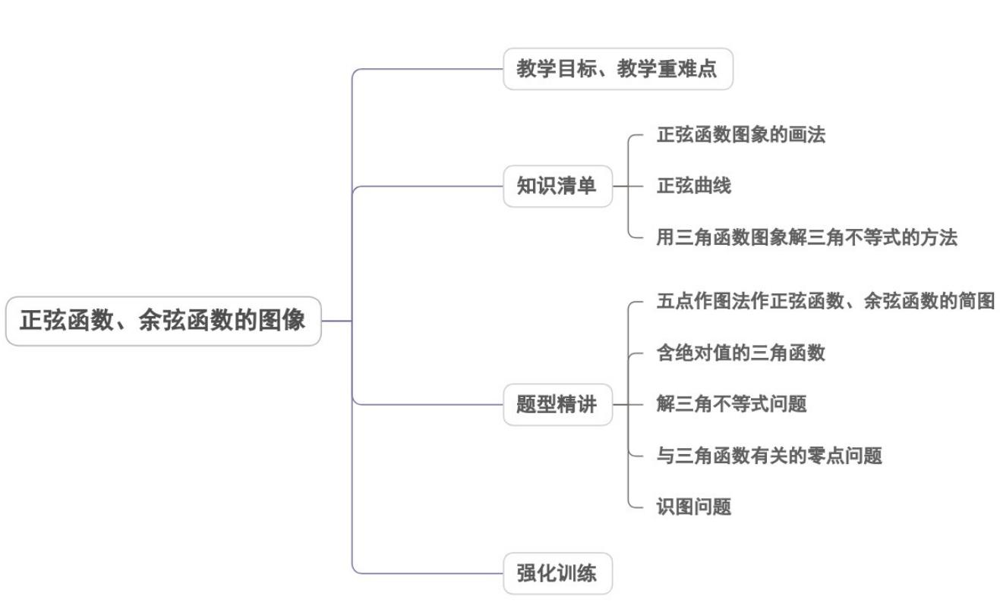
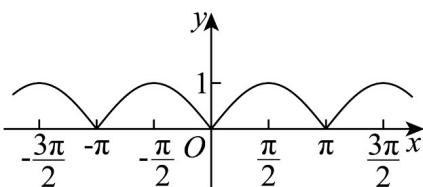
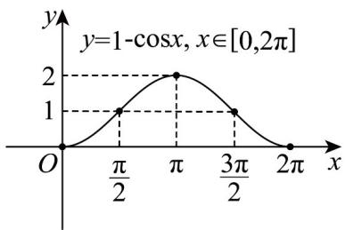
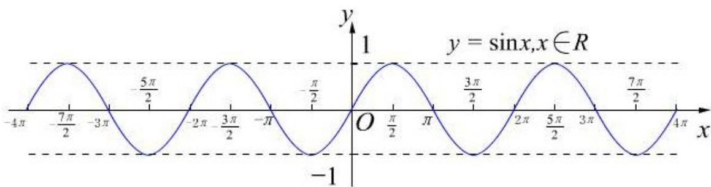
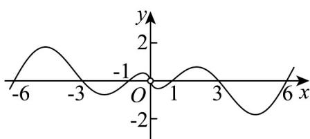
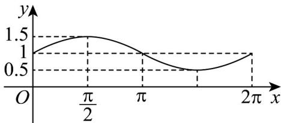

<!-- source-part:1 pages:1-47 -->

## 专题5.4.1 正弦函数、余弦函数的图象

## 内容概览

## 教学目标、教学重难点

<table><tr><td>教学目标</td><td>1.理解并掌握用单位圆作正弦函数以及作余弦函数的图象的方法:掌握数形结合的优势。2.通过两类函数图象认识函数图象的特点,并能通过两类图象的形状掌握两类函数的性质。</td></tr><tr><td>教学重难点</td><td>1.重点:会作正弦函数、余弦函数的图象的同时,能认识图象与三角函数的密切关系,并能解决与图象有关的三角函数问题2.难点:会作正弦函数、余弦函数的图象的同时,能认识图象与三角函数的密切关系,并能解决与图象有关的三角函数问题</td></tr></table>

## 知识清单

## 知识点 01 正弦函数图象的画法

1、描点法：按照列表、描点、连线三步法作出正弦函数图象的方法。

2、几何法：利用三角函数线作出正弦函数在 $[0,2\pi ]$ 内的图象，再通过平移得到 $y = \sin x$ 的图象.

3、五点法：先描出正弦曲线的波峰、波谷和三个平衡位置这五个点，再利用光滑曲线把这五点连接起来，就

得到正弦曲线在一个周期内的图象.

在确定正弦函数 $y = \sin x$ 在 $[0, 2\pi]$ 上的图象形状时，起关键作用的五个点是 $(0, 0), (\frac{\pi}{2}, 1), (\pi, 0), (\frac{3}{2}\pi, -1), (2\pi, 0)$

【即学即练】

1. 用“五点法”作 $y = 3\sin 3x + 1$ 的图象，首先描出的五个点的横坐标是（）

【答案】
A. 0, $\frac{\pi}{2}$ , $\pi$ , $\frac{3\pi}{2}$ , $2\pi$ B. 0, $\frac{\pi}{4}$ , $\frac{\pi}{2}$ , $\frac{3\pi}{4}$ , $\pi$ C. 0, $\pi$ , $2\pi$ , $3\pi$ , $4\pi$ D. 0, $\frac{\pi}{6}$ , $\frac{\pi}{3}$ , $\frac{\pi}{2}$ , $\frac{2\pi}{3}$

【答案】D

【详解】由“五点法”作图知，令 $3x = 0, \frac{\pi}{2}, \pi, \frac{3}{2}\pi, 2\pi$

解得 $x=0,\frac{\pi}{6},\frac{\pi}{3},\frac{\pi}{2},\frac{2\pi}{3}$ ，即为五个关键点的横坐标.

故选：D.

2. 作出下列函数的大致图象：

(1) $y = |\sin x|$ , $x \in \mathbb{R}$ .

(2) $y = 1 - \cos x, x \in [0, 2\pi]$ .

【答案】 $^{(1)}$ 作图见解析

(2)作图见解析

【详解】（1）因为 $y = \left| \sin x \right|$ 的定义域为 R，关于原点对称，

$\left|\sin(-x)\right|=\left|-\sin x\right|=\left|\sin x\right|$ ，故 $\left|-\sin x\right|$ 为偶函数，

又 $\left|\sin\left(\pi+x\right)\right|=\left|-\sin x\right|=\left|\sin x\right|$ ，所以函数 $f(x)=\left|\sin x\right|$ 是以 $\pi$ 为周期的周期函数.

列表

<table><tr><td>x</td><td>0</td><td> $\frac{\pi}{2}$ </td><td> $\pi$ </td></tr><tr><td>y = sin x</td><td>0</td><td>1</td><td>0</td></tr><tr><td>y =|sin x|</td><td>0</td><td>1</td><td>0</td></tr></table>

作图：先作出 $\left(0,\pi \right]$ 的图象，又原函数是偶函数，且周期为 $\pi$ ，将图象向两边延伸，即可得函数 $y = |\sin x|$

$x \in R$ 的图象·

(2) 按五个关键点列表：

<table><tr><td>x</td><td>0</td><td> $\frac{\pi}{2}$ </td><td> $\pi$ </td><td> $\frac{3\pi}{2}$ </td><td> $2\pi$ </td></tr><tr><td>cosx</td><td>1</td><td>0</td><td>-1</td><td>0</td><td>1</td></tr><tr><td> $1 - \cos x$ </td><td>0</td><td>1</td><td>2</td><td>1</td><td>0</td></tr></table>

描点，并将它们用光滑的曲线连接起来（如图）：

## 知识点 02 正弦曲线

1. 定义：正弦函数 $y = \sin x (x \in R)$ 的图象叫做正弦曲线。

2. 图象

【即学即练】

1. 已知函数 $f(x) = \ln |x|, g(x) = \sin x$ ，某函数的部分图象如图所示，则该函数可能是（）

【答案】

$\mathsf{A}$ $y = f(x) + g(x)$

B $y = f(x) - g(x)$

C. $y = f(x)g(x)$ D. $y = \frac{g(x)}{f(x)}$

【答案】C

【详解】函数 $f(x)=\ln|x|$ , $g(x)=\sin x$ ，定义域为 $(-∞,0)∪(0,+∞)$ ，f(x) 是偶函数，g(x) 是奇函数，
对于 A, B, $y = f(x) + g(x)$ 及 $y = f(x) - g(x)$ 为非奇非偶函数，与函数图象不符；

对于 D，当 x=1 时， $f(1)=0$ ，分母为 0，不存在函数值，排除 D，

故选:C

2. 函数 $y = f(x)$ ，其中 $f(x) = a\sin x + b$ ，（ $x \in [0, 2\pi]$ ），（ $a, b \in \mathbb{R}$ ），它的图象如图所示，则 $y = f(x)$ 的解析式为（）

【答案】

的解析式为（）

A. $f(x) = \frac{1}{2}\sin x + 1$ $x\in [0,2\pi ]$ B. $f(x) = \sin x + \frac{1}{2},x\in [0,2\pi ]$ C. $f(x) = \frac{3}{2}\sin x + 1$ $x\in [0,2\pi ]$ D. $f(x) = \frac{3}{2}\sin x + \frac{1}{2},x\in [0,2\pi ]$

【答案】A

【详解】点 $(0,1)$ 与 $\left(\frac{\pi}{2},1.5\right)$ 代入 $f(x)=a\sin x+b$ 中，

可得 $\left\{\begin{aligned}b&=1\\ a+b&=1.5\end{aligned}\right.$ ，解得 b=1， $a=0.5\cdot$

故选：A.

## 知识点 03 用三角函数图象解三角不等式的方法

1、作出相应正弦函数或余弦函数在 $[0,2\pi]$ 上的图象；

2、写出适合不等式在区间 $[0,2\pi ]$ 上的解集；

3、根据公式一写出不等式的解集.

【即学即练】

1. 设函数 $f(x) = 2\sin \left(x + \frac{\pi}{3}\right), x \in \mathbf{R}$

(1)求 $f(x) = 1$ 在 $[0,\pi ]$ 上的解；

(2)求 $y = f(x)$ ， $x \in \left[-\frac{\pi}{2}, \frac{\pi}{2}\right]$ 的增区间。

【答案】(1) $\frac{\pi}{2}$

(2) $\left(-\frac{\pi}{2},\frac{\pi}{6}\right)$

【详解】（1）令 $f(x)=2\sin\left(x+\frac{\pi}{3}\right)=1$ ，所以 $x=-\frac{\pi}{6}+2k\pi$ 或 $\frac{\pi}{2}+2k\pi$ ， $k\in Z$ ，

因为 $x \in [0, \pi]$ ，所以 $x = \frac{\pi}{2}$ .

(2) 令 $-\frac{\pi}{2} + 2k\pi < x + \frac{\pi}{3} < \frac{\pi}{2} + 2k\pi$ ， $k \in \mathbb{Z}$ ，解得 $-\frac{5\pi}{6} + 2k\pi < x < \frac{\pi}{6} + 2k\pi (k \in \mathbb{Z})$ 。

因为 $x \in \left[-\frac{\pi}{2}, \frac{\pi}{2}\right]$ ，所以 $y = f(x)$ 的增区间为 $\left(-\frac{\pi}{2}, \frac{\pi}{6}\right)$ .

2．已知 $f(x)=\sin(\omega x+\varphi),(\omega>0,0\leq\varphi<\pi)$ ，最小正周期为 $\pi$ ，且对任意的 $x\in R$ ，都有 $f\left(\frac{\pi}{6}-x\right)=f(x)$ .

(1)求 $f(x)$ 的解析式及单调递增区间；

(2)设函数 $g(x) = 2f\left(x + \frac{\pi}{6}\right) + 1,$ 若存在 $x\in \left[-\frac{\pi}{6},\frac{\pi}{12}\right],$ 使得方程 $g^{2}(x) - mg(x) - 1 = 0$ 有解，求实数 $m$ 的取值范围.

【答案】(1) $f(x)=\sin\left(2x+\frac{\pi}{3}\right)$ ，单调递增区间为 $\left[-\frac{5\pi}{12}+k\pi,\frac{\pi}{12}+k\pi\right],k\in\mathbf{Z}$

(2) $\left[\frac{3}{2},\frac{8}{3}\right]$

【详解】（1）由函数 $f(x)$ 最小正周期为 $\pi$ ，可得 $\frac{2\pi}{\omega} = \pi$ ，可得 $\omega = 2$ ，即 $f(x) = \sin (2x + \varphi)$ ，又由对任意的

$x \in R$ ，都有 $f\left(\frac{\pi}{6}-x\right)=f(x)$ ，可得 $f(x)$ 关于 $x=\frac{\pi}{12}$ 对称，

即 $2 \times \frac{\pi}{12} + \varphi = \frac{\pi}{2} + k\pi, k \in \mathbf{Z}$ ，即 $\varphi = \frac{\pi}{3} + k\pi, k \in \mathbf{Z}$ ，

因为 $0 \leq \varphi < \pi$ ，可得 $\varphi = \frac{\pi}{3}$ ，则 $f(x) = \sin\left(2x + \frac{\pi}{3}\right)$ ;

令 $-\frac{\pi}{2} + 2k\pi \leq 2x + \frac{\pi}{3} \leq \frac{\pi}{2} + 2k\pi$ ，则： $-\frac{5\pi}{12} + k\pi \leq x \leq \frac{\pi}{12} + k\pi$

故 $f(x)$ 的单调递增区间为： $\left[-\frac{5\pi}{12}+k\pi,\frac{\pi}{12}+k\pi\right],k\in\mathbf{Z}$

(2) 由 $g(x) = 2f\left(x + \frac{\pi}{6}\right) + 1 = 2\sin \left(2x + \frac{\pi}{3} + \frac{\pi}{3}\right) + 1 = 2\sin \left(2x + \frac{2\pi}{3}\right) + 1$

因为 $x \in \left[-\frac{\pi}{6}, \frac{\pi}{12}\right]$ ，可得 $2x + \frac{2\pi}{3} \in \left[\frac{\pi}{3}, \frac{5\pi}{6}\right]$

所以 $\sin\left(2x+\frac{\pi}{3}\right)\in\left[\frac{1}{2},1\right]$ ，即 $g(x)\in[2,3]$ ，

又由 $x \in \left[-\frac{\pi}{6}, \frac{\pi}{12}\right]$ ，方程 $g^{2}(x) - mg(x) - 1 = 0$ 有解，

即方程 $mg(x)=g^{2}(x)-1$ 有解，即 $m=\frac{g^{2}(x)-1}{g(x)}$ 有解，

令 $t = g(x) \in [2,3]$ ，即 $m = \frac{t^{2} - 1}{t} = t - \frac{1}{t}$ 有解，

令 $h(t) = t - \frac{1}{t}$ 在 $t\in [2,3]$ 上为单调递增函数，

则 $h(t)_{\mathrm{max}} = h(3) = \frac{8}{3}, h(t)_{\mathrm{min}} = h(2) = \frac{3}{2}$ ，所以 $\frac{3}{2} \leq m \leq \frac{8}{3}$

即实数 $m$ 的取值范围为 $\left[\frac{3}{2},\frac{8}{3}\right]$

## 题型精讲

![[高中/课堂同步/题库/人教A版高中数学同步讲义(2026)/01_必修第一册/第五章 三角函数/专题5.4.1 正弦函数、余弦函数的图象（高效培优讲义）数学人教A版2019高一必修第一册/题型01_五点作图法作正弦函数_余弦函数的简图/题型01_五点作图法作正弦函数_余弦函数的简图.md]]
![[高中/课堂同步/题库/人教A版高中数学同步讲义(2026)/01_必修第一册/第五章 三角函数/专题5.4.1 正弦函数、余弦函数的图象（高效培优讲义）数学人教A版2019高一必修第一册/题型02_含绝对值的三角函数/题型02_含绝对值的三角函数.md]]
![[高中/课堂同步/题库/人教A版高中数学同步讲义(2026)/01_必修第一册/第五章 三角函数/专题5.4.1 正弦函数、余弦函数的图象（高效培优讲义）数学人教A版2019高一必修第一册/题型03_解三角不等式问题/题型03_解三角不等式问题.md]]
![[高中/课堂同步/题库/人教A版高中数学同步讲义(2026)/01_必修第一册/第五章 三角函数/专题5.4.1 正弦函数、余弦函数的图象（高效培优讲义）数学人教A版2019高一必修第一册/题型04_与三角函数有关的零点问题/题型04_与三角函数有关的零点问题.md]]
![[高中/课堂同步/题库/人教A版高中数学同步讲义(2026)/01_必修第一册/第五章 三角函数/专题5.4.1 正弦函数、余弦函数的图象（高效培优讲义）数学人教A版2019高一必修第一册/题型05_识图问题/题型05_识图问题.md]]
![[高中/课堂同步/题库/人教A版高中数学同步讲义(2026)/01_必修第一册/第五章 三角函数/专题5.4.1 正弦函数、余弦函数的图象（高效培优讲义）数学人教A版2019高一必修第一册/强化训练/强化训练.md]]
