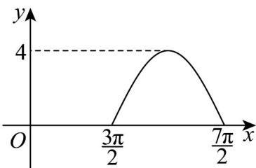

<!-- question-source:start -->
18. 已知函数 $f(x) = A \sin (\omega x + \varphi) (A > 0, \omega > 0, |\varphi| < \pi)$ 的部分图象如图所示.

(1)求A， $\omega$ ， $\varphi$

(2)已知函数 $g(x) = f(x) + |f(x)|$

①求 $g(x)$ 的分段解析式；

②若 $g(x)$ 在 $[2\pi, m]$ 上的图象与直线 $y = 4\sqrt{2}$ 恰有3个公共点，求 $m$ 的取值范围.
<!-- question-source:end -->

![[高中/课堂同步/题库/人教A版高中数学同步讲义(2026)/01_必修第一册/第五章 三角函数/专题5.4.1 正弦函数、余弦函数的图象（高效培优讲义）数学人教A版2019高一必修第一册/强化训练/questions/answers/Q00076363A1.md]]
