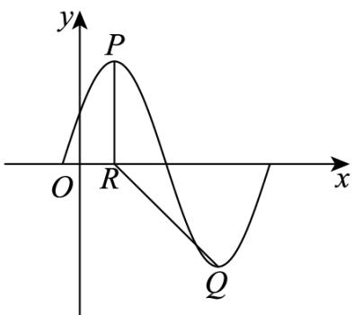

<!-- question-source:start -->
19. 已知函数 $f(x) = A \sin \left( \frac{\pi}{3} x + \varphi \right)$ ( $A > 0$ , $0 < \varphi < \frac{\pi}{2}$ ), $f(x)$ 的部分图象如图所示, $P$ , $Q$ 分别为该图象的

最高点和最低点，点 P 的坐标为 $(1, A)$ .

(1)求 $f(x)$ 的最小正周期及 $\varphi$ 的值；

(2)若点 $R$ 的坐标为 $(1,0)$ ， $\angle PRQ = \frac{3}{4}\pi$ ，求 $A$ 的值。
<!-- question-source:end -->

![[高中/课堂同步/题库/人教A版高中数学同步讲义(2026)/01_必修第一册/第五章 三角函数/专题5.4.1 正弦函数、余弦函数的图象（高效培优讲义）数学人教A版2019高一必修第一册/强化训练/questions/answers/Q00076364A1.md]]
