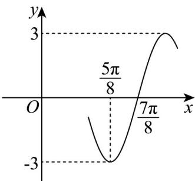

<!-- question-source:start -->
20. 已知函数 $f(x) = A \sin (\omega x + \varphi) \left( A > 0, \omega > 0, |\rho| < \frac{\pi}{2} \right)$ 的部分图象如图所示.

(1)求 $f(x)$ 的解析式；

(2)求 $f(x)$ 在 $\left[\frac{\pi}{24},\frac{11\pi}{24}\right]$ 上的值域.
<!-- question-source:end -->

![[高中/课堂同步/题库/人教A版高中数学同步讲义(2026)/01_必修第一册/第五章 三角函数/专题5.4.1 正弦函数、余弦函数的图象（高效培优讲义）数学人教A版2019高一必修第一册/强化训练/questions/answers/Q00076365A1.md]]
