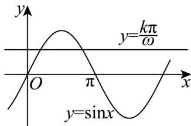

> [!faq]- 《专题5.4.1 正弦函数、余弦函数的图象（高效培优讲义）数学人教A版2019高一必修第一册》官方解析
>
> > [!success]- **【答案】** A
>
> > [!note]- **【解析】**
> > 当 $k = 1$ 时， $\sin x = \frac{\pi}{\omega}$ ，当 $k = 2$ 时， $\sin x = \frac{2\pi}{\omega}$ ，当 $k = 3$ 时， $\sin x = \frac{3\pi}{\omega}$ ，…，
> >
> > 由题意及曲线 $y = \sin x$ 在区间 $(0,\pi)$ 内的图象，
> >
> > 可知方程 $\sin x = \frac{k\pi}{\omega} (k = 1, 2, \cdots, 1012)$ 分别有两个不同实根，且各根均不同，
> >
> > 所以需满足 $\frac{1013\pi}{\omega} = 1$ ，所以 $\omega = 1013\pi$
> >
> > 
> >
> > 故选 **A**.
