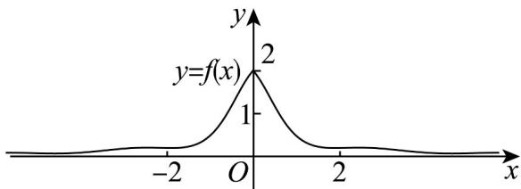

> [!faq]- 《专题5.4.1 正弦函数、余弦函数的图象（高效培优讲义）数学人教A版2019高一必修第一册》官方解析
>
> > [!success]- **【答案】**  A. $f(x) = \pi^{|x|} + \frac{\sin x}{x^2 + 1} + 1$ B. $f(x) = \pi^{-|x|} + \frac{\cos^2 x}{x^2 + 1}$ C. $f(x)=\pi^{-|x|}+\frac{\sin x}{x^{2}+1}+1$ D. $f(x)=\pi^{-|x|}+\frac{\cos x}{x^{2}+1}$
>
> > [!note]- **【解析】**
> > 由图形判断函数的定义域为 R，且为偶函数，
> >
> > 对 A， $f(-x)=\pi^{|-x|}+\frac{\sin(-x)}{(-x)^{2}+1}+1=\pi^{|x|}-\frac{\sin x}{x^{2}+1}+1\neq f(x)$ ，故错误；
> >
> > 对 C， $f(-x)=\pi^{-|-x|}+\frac{\sin(-x)}{(-x)^{2}+1}+1=\pi^{-|x|}-\frac{\sin x}{x^{2}+1}+1\neq f(x)$ ，故错误；
> >
> > 对 B， $f(-x)=\pi^{-|-x|}+\frac{\cos^{2}(-x)}{(-x)^{2}+1}=\pi^{-|x|}+\frac{\cos^{2}x}{x^{2}+1}=f(x)$
> >
> > 当 $x \to +\infty, f(x) \to 0$ 且始终是正数，故正确；
> >
> > 对 D， $f(-x)=\pi^{-|-x|}+\frac{\cos(-x)}{(-x)^{2}+1}=\pi^{-|x|}+\frac{\cos x}{x^{2}+1}=f(x)$
> >
> > 当 $x \to +\infty, \pi^{-|x|} \to 0$ ，但 $\frac{\cos x}{x^2 + 1}$ 可以为负数，所以不符合要求，故错误
> >
> > 故选 **B**
