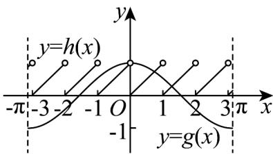
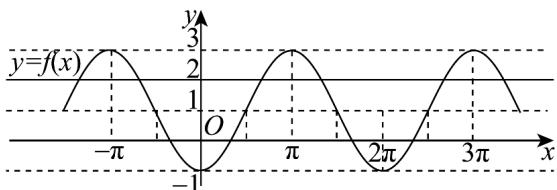

> [!faq]- 《专题5.4.1 正弦函数、余弦函数的图象（高效培优讲义）数学人教A版2019高一必修第一册》官方解析
>
> > [!success]- **【答案】** A
>
> > [!note]- **【解析】**
> > 由 $f(x) = 0$ ，得 $\cos x = x - [x]$ ，令函数 $g(x) = \cos x$ 与 $h(x) = x - [x]$
> >
> > 依题意，所求问题即为函数 $y = g(x)$ 与 $y = h(x)$ 在 $[- \pi, \pi]$ 上的交点个数，
> >
> > 在同一坐标系内作出函数 $y = g(x)$ 与 $y = h(x)$ 在 $[- \pi, \pi]$ 上的图象，
> >
> > 
> >
> > 观察图象得函数 $y = g(x)$ 与 $y = h(x)$ 在 $[- \pi, \pi]$ 上的图象有2个交点，
> >
> > 所以函数 $f(x)$ 在区间 $\left[-\pi, \pi\right]$ 上的零点个数为 2.
> >
> > 故选：A
> >
> > 4. 函数 $f(x)=1-2\cos x, x\in(t,t+\pi), t\in\mathbb{R}$ ，关于函数 $g(x)=f(x)-2$ 的零点情况说法错误的是（）
> >
> > 【答案】
> >
> > A. 当 t 取某些值时，无零点
> >
> > B. 当 t 取某些值时，恰有 1 个零点
> >
> > C. 当 t 取某些值时，恰有 2 个不同的零点
> >
> > D. 当 t 取某些值时，恰有 3 个不同的零点.
> >
> > 【答案】D
> >
> > 【详解】画出函数 $f(x)=1-2\cos x$ 的图象，如图所示，
> >
> > 因为 $g(x) = f(x) - 2$ ，令 $g(x) = 0$ ，即 $f(x) = 2$
> >
> > 则函数 $y = g(x)$ 的零点，即为 $y = f(x)$ 与 y = 2 的交点的横坐标，
> >
> > 对于 $\mathsf{A}$ ，当 $t = -\frac{\pi}{2}$ 时，在 $x\in \left(-\frac{\pi}{2},\frac{\pi}{2}\right)$ 上 $y = f(x)$ 与 $y = 2$ 无公共点，所以 $\mathsf{A}$ 正确；
> >
> > 对于 B，当 t=0 时，在 $x\in(0,\pi)$ 上 $y=f(x)$ 与 y=2 只有 1 个公共点，所以 B 正确；
> >
> > 对于 C，当 $t=\frac{\pi}{2}$ 时，在 $x\in\left(\frac{\pi}{2},\frac{3\pi}{2}\right)$ 上 $y=f(x)$ 与 y=2 有 2 个公共点，所以 C 正确；
> >
> > 对于 $D$ ，由图象可得，函数 $y = f(x)$ 与 $y = 2$ 不相邻的两个交点的横坐标间的距离为最小正周期的整数倍，
> >
> > 即 $d = 2k\pi ,k\in \mathbb{Z}$
> >
> > 因为 $x \in (t, t + \pi)$ ，可得 $t + \pi - t < \pi$
> >
> > 所以不存在 $t$ 的值，使得 $y = g(x)$ 有3个零点，所以 $\mathbb{D}$ 不正确
> >
> > 故选：D.
> >
> > 
