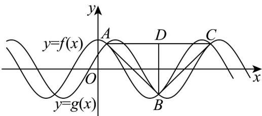

> [!faq]- 《专题5.4.1 正弦函数、余弦函数的图象（高效培优讲义）数学人教A版2019高一必修第一册》官方解析
>
> > [!success]- **【答案】** A
>
> > [!note]- **【解析】**
> > 由题意得， $f(x) = \sin \left(\frac{\pi}{2} -\omega x\right) = \cos \omega x,g(x) = \cos \left(\omega x - \frac{\pi}{3}\right)$
> >
> > 作出两个函数的图象，如图：
> >
> > 
> >
> > 为连续三个交点（不妨设 在 轴下方）， 为 的中点， $A,B,C$ $B\quad x\quad D\quad AC$
> >
> > 由对称性，得VABC是以 $\angle ABC$ 为顶角的等腰三角形， $AC=T=\frac{2\pi}{\omega}$ ，
> >
> > 由 $\cos \omega x = \cos \left(\omega x - \frac{\pi}{3}\right)$ ，整理得 $\cos \omega x = \sqrt{3}\sin \omega x$
> >
> > 解得 $\tan \omega x = \frac{\sqrt{3}}{3}$ ，则 $\cos \omega x = \pm \frac{\sqrt{3}}{2}$
> >
> > 即 $y_{C} = -y_{B} = \frac{\sqrt{3}}{2}$ ，所以 $BD = 2|y_B| = \sqrt{3}$
> >
> > 因为VABC为锐角三角形，则 $\frac{\pi}{4} < \angle ACB < \frac{\pi}{2}$
> >
> > 所以 $\tan\angle ACB=\frac{BD}{DC}=\frac{\sqrt{3}\omega}{\pi}>1$ ，解得 $\omega>\frac{\sqrt{3}\pi}{3}$
> >
> > 故选 **A**.
