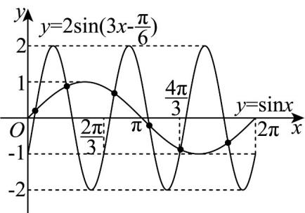
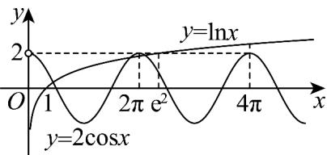

> [!faq]- 《专题5.4.1 正弦函数、余弦函数的图象（高效培优讲义）数学人教A版2019高一必修第一册》官方解析
>
> > [!success]- **【答案】** D
>
> > [!note]- **【解析】**
> > 因为函数 $y = \sin x$ 的最小正周期为 $T = 2\pi$ ，
> > 函数 $y=2\sin\left(3x-\frac{\pi}{6}\right)$ 的最小正周期为 $T=\frac{2\pi}{3}$ ，
> > 所以在 $x \in [0, 2\pi]$ 上函数 $y = 2 \sin \left(3x - \frac{\pi}{6}\right)$ 有三个周期的图象，
> >
> > 在坐标系中结合五点法画出两函数图象，如图所示：
> >
> > 
> >
> > 由图可知，两函数图象有 $^{6}$ 个交点，故 $^{D}$ 正确·
> >
> > 故选：D
> >
> > 9. 函数 $f(x) = \ln |x| - 2\cos x$ 的零点个数为（） A. 2个 B. 3个 C. 4个 D. 6个
> >
> > 【答案】D
> >
> > 【详解】由题意可知： $f(x)$ 的定义域为 $(-∞,0)∪(0,+∞)$
> >
> > 且 $f(-x) = \ln | - x| - 2\cos (-x) = \ln |x| - 2\cos x = f(x)$ ，可知 $f(x)$ 为偶函数，
> >
> > 令 $x > 0$ ， $f(x) = \ln x - 2\cos x = 0$ ，可得 $\ln x = 2\cos x$
> >
> > 
> >
> > 由图象可知 $y = \ln x$ 与 $y = 2 \cos x$ 在 $(0, +\infty)$ 内有 3 个交点，
> >
> > 即 $f(x)$ 在 $(0,+\infty)$ 内有 $^{3}$ 零点，
> >
> > 结合对称性可知 $f(x)$ 在定义域内有 6 个零点.
> >
> > 故选 **D**.
