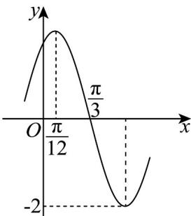

> [!faq]- 《专题5.4.1 正弦函数、余弦函数的图象（高效培优讲义）数学人教A版2019高一必修第一册》官方解析
>
> > [!success]- **【答案】**  A. $f\left(\frac{\pi}{2}\right) = -\sqrt{3}$ B．将 $f(x)$ 的图象向右平移 $\frac{\pi}{3}$ 个单位长度，得到 $y = 2\sin\left(2x - \frac{\pi}{3}\right)$ 的图象 C. 直线 $x=\frac{5\pi}{6}$ 为 $f(x)$ 图象的一条对称轴 D．直线 $y=\sqrt{3}$ 与 $f(x)$ 的图象相交，存在两个交点的横坐标 $t_{1}, t_{2}$ ，使得 $\left|t_{1}-t_{2}\right|=\frac{\pi}{6}$
>
> > [!note]- **【解析】**
> > 由图知， $A=2,\frac{T}{4}=\frac{\pi}{3}-\frac{\pi}{12}=\frac{\pi}{4}$ ，即 $T=\pi=\frac{2\pi}{\omega}$ ，所以 $\omega=2$ 。
> >
> > 将 $\left(\frac{\pi}{3},0\right)$ 代入 $f(x)$ ，得 $2\sin \left(2\times \frac{\pi}{3} +\varphi\right) = 0$ ，解得 $\varphi = k\pi -\frac{2\pi}{3},k\in \mathbf{Z}$
> >
> > 又 $\left|\varphi\right|<\frac{\pi}{2}$ ，当 k=1 时， $\varphi=\frac{\pi}{3}$ ，所以 $f(x)=2\sin\left(2x+\frac{\pi}{3}\right)$ .
> >
> > A， $f\left(\frac{\pi}{2}\right) = 2\sin \left(2\times \frac{\pi}{2} +\frac{\pi}{3}\right) = -2\sin \frac{\pi}{3} = -\sqrt{3}$ 正确；
> >
> > B，将 $f(x)$ 的图象向右平移 $\frac{\pi}{3}$ 个单位长度，得 $f\left(x - \frac{\pi}{3}\right) = 2\sin \left[2\left(x - \frac{\pi}{3}\right) + \frac{\pi}{3}\right] = 2\sin (2x - \frac{\pi}{3})$ 的图象，正确；C， $f\left(\frac{5\pi}{6}\right) = 2\sin \left(2 \times \frac{5\pi}{6} + \frac{\pi}{3}\right) = 0$ ，所以直线 $x = \frac{5\pi}{6}$ 不是对称轴，错误；
> >
> > D，由三角函数的性质知， $2t+\frac{\pi}{3}=\frac{\pi}{3}+2k\pi\quad\text{或}\quad\frac{2\pi}{3}+2k\pi,k\in\mathbf{Z}$
> >
> > 所以 $t_{1}=k\pi,t_{2}=\frac{\pi}{6}+k\pi,k\in Z$ ，显然存在两个交点的横坐标 $t_{1},t_{2}$ 使 $\left|t_{1}-t_{2}\right|=\frac{\pi}{6}$ ，正确.
> >
> > 故选 **ABD**
