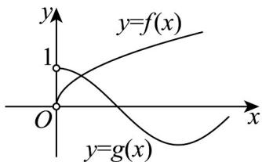

> [!faq]- 《专题5.4.1 正弦函数、余弦函数的图象（高效培优讲义）数学人教A版2019高一必修第一册》官方解析
>
> > [!success]- **【答案】** ACD
>
> > [!note]- **【解析】**
> > 由题可知 $m - 2 = 1$ ，则 $m = 3$
> >
> > 又 $f(x)$ 的图象经过点 $(9,3)$ ，所以 $9^{n} = 3$ ， $n = \frac{1}{2}$
> >
> > 所以 $f(x)=\sqrt{x}$ ，其定义域为 $[0,+\infty)$ ，
> >
> > 所以 $f(x)$ 为非奇非偶函数，且为增函数，故 A, C 正确，B 错误；
> >
> > 因为 $f(x)$ 与 $g(x) = \cos x$ 的图象在区间 $(0, +\infty)$ 上的图象如下图示，其图象有交点，故D正确.
> >
> > 
> >
> > 故选 **ACD**.
