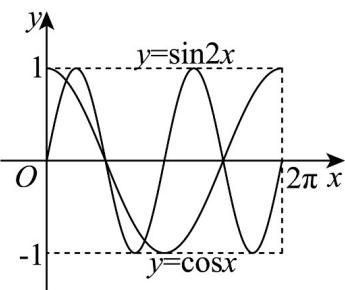

> [!faq]- 《专题5.4.1 正弦函数、余弦函数的图象（高效培优讲义）数学人教A版2019高一必修第一册》官方解析
>
> > [!success]- **【答案】** 4
>
> > [!note]- **【解析】**
> > 在平面直角坐标系中，函数 $y = \sin 2x$ 与 $y = \cos x$ 的图象如图所示，
> >
> > 
> >
> > 根据图象，可得函数 $y = \sin 2x$ 与 $y = \cos x$ 的图象交点个数为 4.
> >
> > 故答案为：4.
