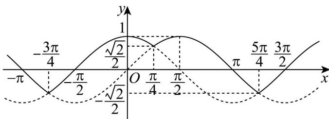

> [!faq]- 《专题5.4.1 正弦函数、余弦函数的图象（高效培优讲义）数学人教A版2019高一必修第一册》官方解析
>
> > [!success]- **【答案】** ②④
>
> > [!note]- **【解析】**
> > 依题意， $\frac{\left|\sin x-\cos x\right|+\sin x+\cos x}{2}=\begin{cases}\sin x,\sin x>\cos x\\\cos x,\sin x\leq\cos x\end{cases}$
> >
> > 则 $f(x)=\frac{|\sin x-\cos x|+\sin x+\cos x}{2}$ ，
> >
> > $$
> > f (x + 2 \pi) = \frac {\left| \sin (x + 2 \pi) - \cos (x + 2 \pi) \right| + \sin (x + 2 \pi) + \cos (x + 2 \pi)}{2}
> > $$
> >
> > $= \frac{|\sin x - \cos x| + \sin x + \cos x}{2} = f(x)$ ，因此函数 $f(x)$ 为周期函数， $2\pi$ 是 $f(x)$ 的一个周期，
> >
> > 作出函数 $f(x)$ 的图象（图中实线），如图：
> >
> > 
> >
> > 观察函数图象，得：
> > - **对于②**：，函数 $f(x)$ 的最小正周期为 $2\pi$ ，②正确；
> > - **对于①**：，函数 $f(x)$ 的最小值为 $-\frac{\sqrt{2}}{2}$ ，①错误；
> > - **对于③**：，当且仅当 $x = 2k\pi$ 或 $x = 2k\pi + \frac{\pi}{2} (k \in \mathbb{Z})$ 时，函数 $f(x)$ 取得最大值1，③错误；
> > - **对于④**：，当且仅当 $2k\pi + \pi < x < 2k\pi + \frac{3\pi}{2} (k \in \mathbf{Z})$ 时， $f(x) < 0$ ，④正确·
> >
> > 所以所有正确结论的序号是②④·
> >
> > 故答案为：②④
