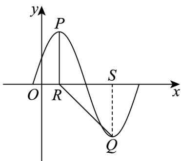

> [!faq]- 《专题5.4.1 正弦函数、余弦函数的图象（高效培优讲义）数学人教A版2019高一必修第一册》官方解析
>
> > [!success]- **【答案】** (1)最小正周期6， $\varphi=\frac{\pi}{6}$ ； (2) A = 3.
>
> > [!note]- **【解析】**
> > （1）函数 $f(x) = A\sin \left(\frac{\pi}{3} x + \varphi\right)$ 的最小正周期 $T = \frac{2\pi}{\frac{\pi}{3}} = 6$ ，
> >
> > 由 $P(1,A)$ 为函数图象的最高点，得 $\frac{\pi}{3} \times 1 + \varphi = \frac{\pi}{2} + 2k\pi$ ， $k \in Z$ ，
> >
> > 解得 $\varphi=\frac{\pi}{6}+2k\pi,\quad k\in Z$ ，而 $0<\varphi<\frac{\pi}{2},$ 所以 $\varphi=\frac{\pi}{6}.$
> >
> > (2) 由 Q 为函数图象的最低点， $P(1, A)$ ， $\frac{T}{2} = 3$ ，得点 Q 的坐标为 $(4, -A)$ ， $R(1, 0)$ ， $PR \perp OR$
> >
> > 又 $\angle PRQ = \frac{3}{4}\pi$ ，则 $\angle QRx = \frac{\pi}{4}$ ，过点 $Q$ 作 $QS\perp OR$ 于点 $S$ ， $S(4,0)$
> >
> > 因此 $A = QS = RS = 3$
> >
> > 
