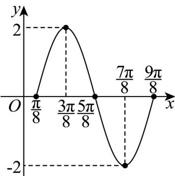

> [!faq]- 《专题5.4.1 正弦函数、余弦函数的图象（高效培优讲义）数学人教A版2019高一必修第一册》官方解析
>
> > [!success]- **【答案】** 答案见解析
>
> > [!note]- **【解析】**
> > 根据五点法列表如下：
> >
> > <table><tr><td> $2x - \frac{\pi}{4}$ </td><td>0</td><td> $\frac{\pi}{2}$ </td><td> $\pi$ </td><td> $\frac{3\pi}{2}$ </td><td> $2\pi$ </td></tr><tr><td> $x$ </td><td> $\frac{\pi}{8}$ </td><td> $\frac{3\pi}{8}$ </td><td> $\frac{5\pi}{8}$ </td><td> $\frac{7\pi}{8}$ </td><td> $\frac{9\pi}{8}$ </td></tr><tr><td> $y$ </td><td>0</td><td>2</td><td>0</td><td>-2</td><td>0</td></tr></table>
> >
> > 
> >
> > ## 方法技巧
> >
> > 1、五点作图法：作正弦曲线、余弦曲线要理解几何法作图，掌握五点法作图。“五点”即 $y = \sin x$ 或 $y = \cos x$ 的
> >
> > 图象在 $[0,2\pi ]$ 内的最高点、最低点和与 $x$ 轴的交点.
> >
> > 2、图象变换：平移变换、对称变换、翻折变换。
