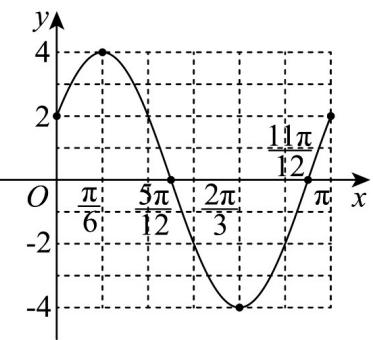

> [!faq]- 《专题5.4.1 正弦函数、余弦函数的图象（高效培优讲义）数学人教A版2019高一必修第一册》官方解析
>
> > [!success]- **【答案】** 答案见解析
>
> > [!note]- **【解析】**
> > 因为 $f(x) = 4\cos \left(2x - \frac{\pi}{3}\right)$ ，所以列表如下：
> >
> > <table><tr><td> $2x - \frac{\pi}{3}$ </td><td> $-\frac{\pi}{3}$ </td><td>0</td><td> $\frac{\pi}{2}$ </td><td> $\pi$ </td><td> $\frac{3\pi}{2}$ </td><td> $\frac{5\pi}{3}$ </td></tr><tr><td> $x$ </td><td>0</td><td> $\frac{\pi}{6}$ </td><td> $\frac{5\pi}{12}$ </td><td> $\frac{2\pi}{3}$ </td><td> $\frac{11\pi}{12}$ </td><td> $\pi$ </td></tr><tr><td> $y$ </td><td>2</td><td>4</td><td>0</td><td>-4</td><td>0</td><td>2</td></tr></table>
> >
> > 
