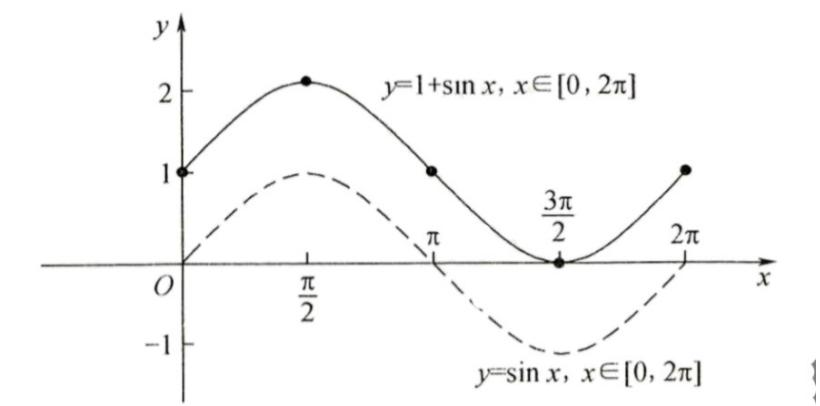
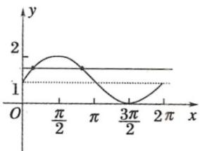

> [!faq]- 《专题5.4.1 正弦函数、余弦函数的图象（高效培优讲义）数学人教A版2019高一必修第一册》官方解析
>
> > [!success]- **【答案】** (1)图象见解析； (2)答案见解析·
>
> > [!note]- **【解析】**
> > （ $^{1}$ ）由题意，列表：
> >
> > <table><tr><td>x</td><td>0</td><td> $\frac{\pi}{2}$ </td><td> $\pi$ </td><td> $\frac{3\pi}{2}$ </td><td> $2\pi$ </td></tr><tr><td>sinx</td><td>0</td><td>1</td><td>0</td><td>-1</td><td>0</td></tr><tr><td>sinx+1</td><td>1</td><td>2</td><td>1</td><td>0</td><td>1</td></tr></table>
> >
> > 根据五点，作图：
> >
> > 
> >
> > (2) $y=1+\sin x,x\in[0,2\pi]$ 其图象如图：
> >
> > 
> >
> > 观察图象得：当 $t < 0$ 或 $t > 2$ 时，有0个交点；
> >
> > 当 $t = 0$ 或 $t = 2$ 时，有1个交点；
> >
> > 当 0 < t < 1 或 1 < t < 2 时，有 $^{2}$ 个交点；
> >
> > 当 $t = 1$ 时，有3个交点·
