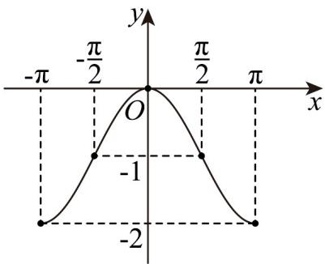

> [!faq]- 《专题5.4.1 正弦函数、余弦函数的图象（高效培优讲义）数学人教A版2019高一必修第一册》官方解析
>
> > [!success]- **【答案】** 作图见解析
>
> > [!note]- **【解析】**
> > 列表如下：
> >
> > <table><tr><td>x</td><td>-π</td><td>-π/2</td><td>0</td><td>π/2</td><td>π</td></tr><tr><td>cos x</td><td>-1</td><td>0</td><td>1</td><td>0</td><td>-1</td></tr><tr><td>-1+cos x</td><td>-2</td><td>-1</td><td>0</td><td>-1</td><td>-2</td></tr></table>
> >
> > 描点、连线得函数 $y = -1 + \cos x$ 在区间 $[- \pi, \pi]$ 内的图象如图所示：
> >
> > 
