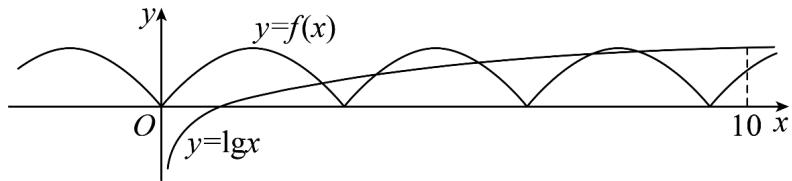

> [!faq]- 《专题5.4.1 正弦函数、余弦函数的图象（高效培优讲义）数学人教A版2019高一必修第一册》官方解析
>
> > [!success]- **【答案】** B
>
> > [!note]- **【解析】**
> > 解：由 $f(x + \pi) = f(x)$ 得函数周期是 $\pi$ ，又 $f(x)$ 偶函数，
> >
> > 且在 $x \in \left[0, \frac{\pi}{2}\right]$ 时， $f(x) = \sin x$ ，因此可得 $f(x) = |\sin x|$
> >
> > $y = \lg |x|$ 是偶函数，作出函数 $y = f(x)$ 与 $x > 0$ 时， $y = \lg |x| = \lg x$ 的图象，
> >
> > 由图象可知，当 x > 0 时，两函数图象有 $^{5}$ 个交点.
> >
> > 又函数 $y = f(x)$ 与 $y = \lg |x|$ 均为偶函数，
> >
> > 所以函数 $y = f(x) - \lg |x|$ 的零点个数是 10.
> >
> > 即函数 $y = f(x) - \lg |x|$ 的零点个数是 10 .
> >
> > 故选：B.
> >
> > C
> >
> > B
> > 
> >
> > ## 方法技巧
> >
> > 分类讨论解决绝对值问题
