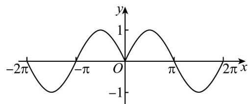
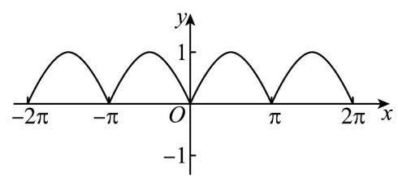
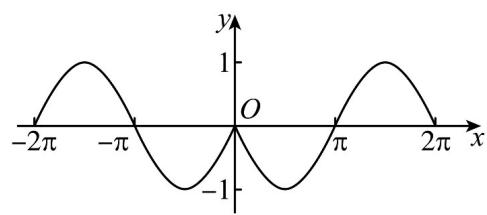
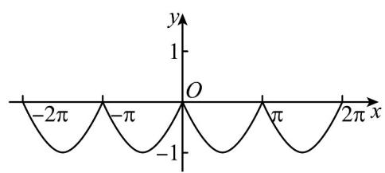
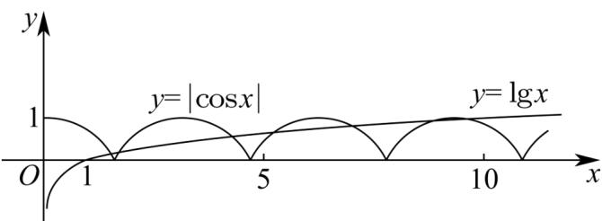

> [!faq]- 《专题5.4.1 正弦函数、余弦函数的图象（高效培优讲义）数学人教A版2019高一必修第一册》官方解析
>
> > [!success]- **【答案】** A    D 
>
> > [!note]- **【解析】**
> > 由题， $y = -\sin |x|$ 为偶函数，且当 x > 0 时 $y = -\sin x$ ，
> > 又 $y = -\sin x$ 为 $y = \sin x$ 的图象沿 x 轴翻折.
> >
> > 故选：C
> >
> > $$
> > f (x)
> > $$
> >
> > $$
> > f (x)
> > $$
> >
> > 记作 $(A,B)$ ，规定 $(A,B)$ 和 $(B,A)$ 是同一对友好点．已知 $f(x) = \begin{cases} |\cos x|,x & 0\\ -\lg (-x),x < 0 \end{cases}$ ，则函数 $f(x)$ 的友好点共有（）A.3对 B.5对 C.7对 D.14对
> >
> > 【答案】C
> >
> > 【详解】因为函数 $y = -\lg(-x)$ 的图象与函数 $y = \lg x$ 的图象关于原点对称，
> > 所以函数 $f(x)$ 的友好点的对数即方程 $\left|\cos x\right|=\lg x,\quad x>0$ 的解的个数，
> > 即函数 $y = \left| \cos x \right|$ 与 $y = \lg x$ 的图象的交点个数，
> > 作出函数 $y = \left| \cos x \right| (x - 0)$ 与 $y = \lg x$ 的图象，如图所示：
> >
> > 
> >
> > 可知共有 $^{7}$ 个交点，即函数 $f(x)$ 的友好点共有 $^{7}$ 对
> >
> > 故选 **C**.
