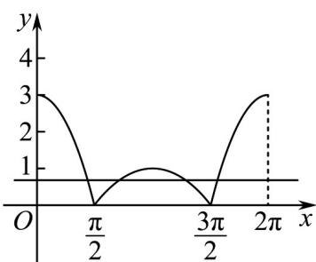

> [!faq]- 《专题5.4.1 正弦函数、余弦函数的图象（高效培优讲义）数学人教A版2019高一必修第一册》官方解析
>
> > [!success]- **【答案】** 4
>
> > [!note]- **【解析】**
> > 令 $f(x)=0$ ，则 $2|\cos x|+\cos x=\frac{2}{3}$ ，
> >
> > 设 $g(x) = 2|\cos x| + \cos x$
> >
> > 则当 $x \in \left[0, \frac{\pi}{2}\right] \cup \left[\frac{3\pi}{2}, 2\pi\right]$ 时， $g(x) = 3 \cos x$
> >
> > 当 $x \in \left(\frac{\pi}{2}, \frac{3\pi}{2}\right)$ 时， $g(x) = -\cos x$
> >
> > 画出函数 $y = g(x)$ 的图象，
> >
> > 
> >
> > 易知函数 $y = g(x)$ 的图象与直线 $y = \frac{2}{3}$ 有 4 个不同的交点，
> >
> > 故答案为：4
