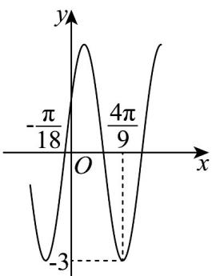

<!-- question-source:start -->
【变式2】已知函数 $f(x) = A\sin (\omega x + \varphi)$ （ $A > 0, \omega > 0, |\varphi| < \frac{\pi}{2}$ ）的部分图象如图所示，将函数 $f(x)$ 的图象上所有点的横坐标变为原来的 $\frac{3}{2}$ （纵坐标不变），再将所得函数图象向右平移 $\frac{\pi}{6}$ 个单位长度，得到函数 $g(x)$ 的图象。

(1)求函数 $f(x)$ 和 $g(x)$ 的解析式；

(2)求函数 $g(x)$ 的单调递增区间和对称中心；

(3)求函数 $g(x)$ 在区间 $\left[-\frac{\pi}{12},\frac{5\pi}{12}\right]$ 上的值域.
<!-- question-source:end -->

![[高中/课堂同步/题库/人教A版高中数学同步讲义(2026)/01_必修第一册/第五章 三角函数/专题5.4.1 正弦函数、余弦函数的图象（高效培优讲义）数学人教A版2019高一必修第一册/题型03_解三角不等式问题/questions/answers/Q00076338A1.md]]
